# SECTION 4. Basic Plots

**Generation of random data for the examples**
  
  We generate a vector x of 15 values from a normal random distribution with mean=0 and standard deviation=1  and a vector y of 15 values from a normal random distribution with mean=0.2 and standard deviation=1:    
    

``` r
set.seed(123)
x<-rnorm(15,0,1)
i<-c(1:15)
set.seed(4)
y<-rnorm(15,0.2,1)
```
  

## Line charts
    
They are particularly valuable for depicting trends over time or sequences of data points. In this example, we are plotting a single numerical vector, "x" which contains 15 data points. The x-axis of the line chart displays an index for each of these 15 data points in the "x" vector. 
  

``` r
length(x)
```

```
## [1] 15
```

``` r
plot(x)  #plots the values of x (vertical axis) as a function of the index of each value (horizontal axis)
```

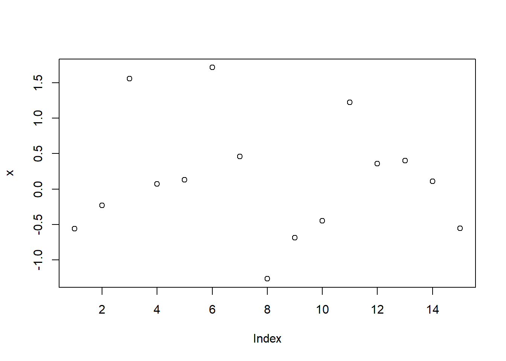
  
### Key Characteristics:
  
1. **Data type:** Line charts are suitable for visualizing **one-dimensional numerical data**.
2. **x-Axis:** In a line chart, the x-axis typically represents the index or sequence of data points, especially when plotting a single vector.
3. **Y-Axis:** The y-axis represents the values of the numerical variable being plotted.
  
### Use Cases:
  
* **Sequential Data:** They are well-suited for visualizing sequences of data points or events.
* **Trend Analysis:** Line charts are excellent for identifying trends or patterns in data, such as changes over time (e.g., observe the trend of monthly blood pressure measurements for 1 year)
  
### Customization Options:
  
* `col` (color): You can specify the colour of the points or lines in the chart.
  
* `pch` (point character): This option lets you choose the symbol or marker for data points.
  
* `main` (main title): You can add a title to the plot using the main parameter within the plot() function.
  
* `type` (line type): You can control whether lines are drawn between points, or if only points are plotted.
  
* `xlab` (x-axis label): Customize the label for the x-axis.
  
* `ylab` (y-axis label): Customize the label for the y-axis.
  
* `xlim` and `ylim` (axis limits): Define the range of values displayed on the x and y axes, respectively.
  

``` r
plot(x, col = 3, type="o", pch= 3,xlab="This is the x label",ylab="This is the y label", main = "Title of the plot")  
```

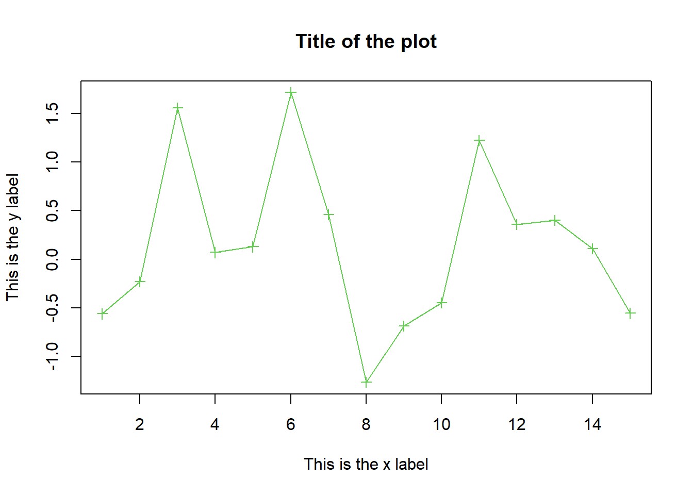
  
The `points()` function allows to introduce supplementary data points to an existent plot. This functionality is especially handy when you wish to expand upon an already-created graph, incorporating additional information without recreating the entire plot.
  

``` r
plot(x, type="o", xlab="",ylim=c(-1.5,2.5)) 
points(y, col=2)     
```

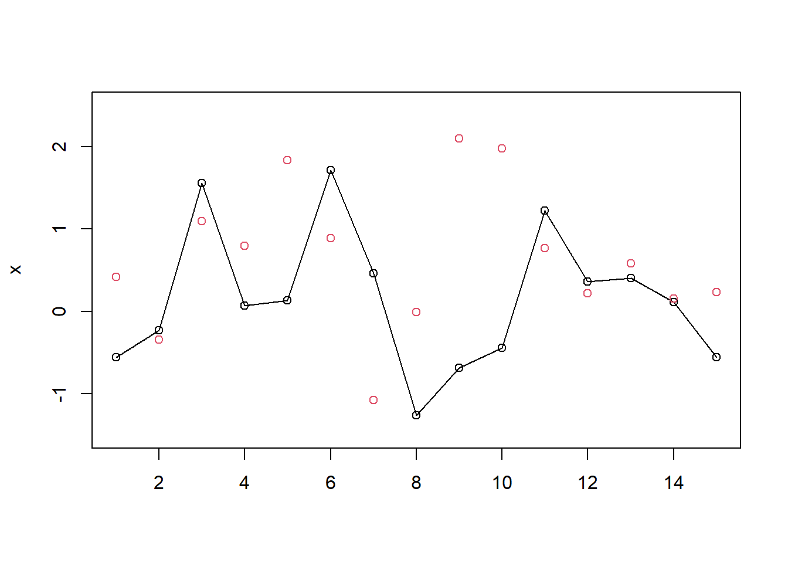
  
The `lines()` function allows you to incorporate additional data points and connecting them with lines. This function is particularly useful when you have multiple datasets or want to illustrate the relationship between different several one-dimensional numerical variables within the same plot.
  

``` r
plot(x, type="o", xlab="",ylim=c(-1.5,2.5)) 
lines(y, type="o", col=2)
```


  
The `range` function in the context of plotting is a convenient tool for automatically determining the minimum and maximum values among two datasets, denoted as 'x' and 'y'. This function eliminates the need for manual inspection to identify the extreme values on both the x and y-axes, ensuring that your plot is appropriately scaled for optimal visualization.
  

``` r
range(x,y)
```

```
## [1] -1.265061  2.096540
```

``` r
plot(x, type="o", xlab="", ylim=range(x,y))
lines(y, type="o", col=2)
```

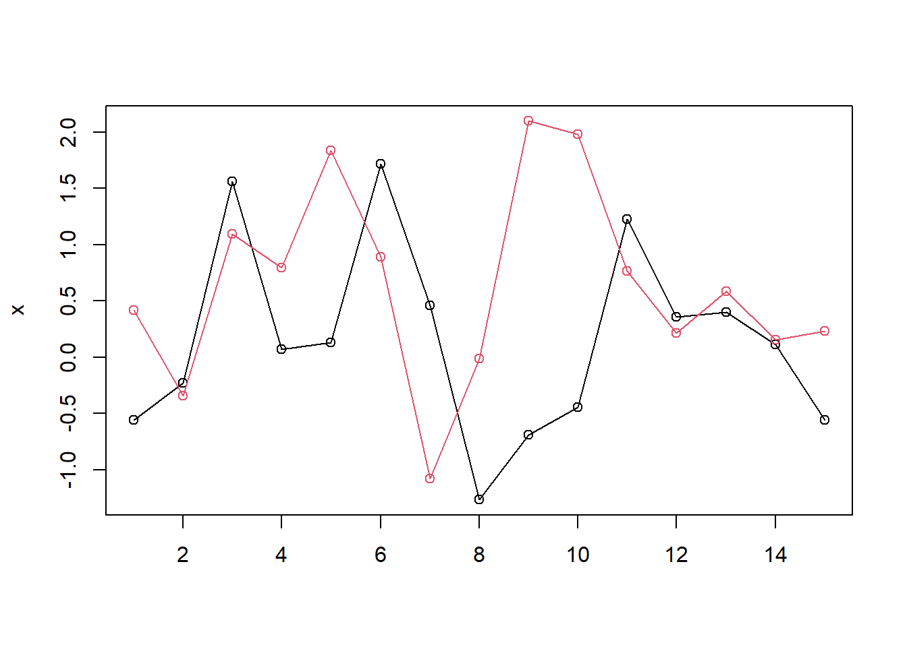
  
## Dot plot
  
Dot plots, generated using the `dotchart()` function, are a valuable tool for visualizing the distribution and ranking of numerical data. These plots resemble line charts, but with a key distinction: in dot plots, the numerical variable's values are plotted along the horizontal axis, while the vertical axis is used to represent data points' indices.
  

``` r
dotchart(x, labels=i)  
```

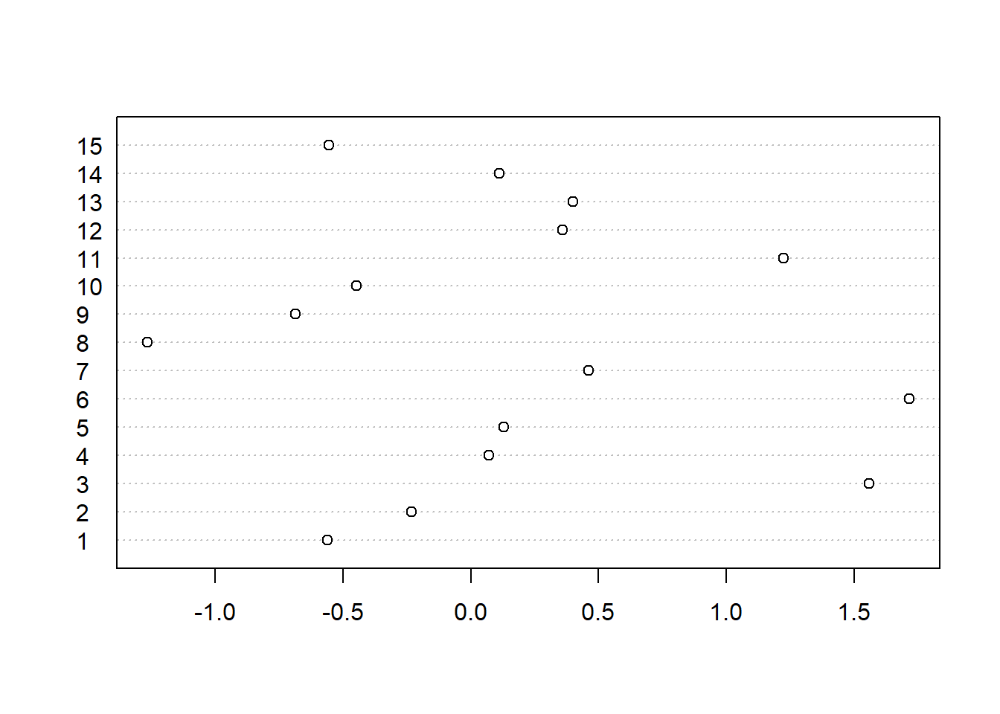
  
### Key characteristics
  
1. **Data type** Dot plots are primarily used for visualizing a single numerical variable (commonly referred to as 'x').
2. **X-Axis:** The values of the numerical variable ('x') are plotted along the horizontal axis, making it easy to compare the magnitudes of data points.
3. **Vertical Axis:** The vertical axis represents data point indices or labels, aiding in identifying individual data points.
  
### Use cases
They are well-suited for displaying the distribution of data and ranking data points based on their values.
  

``` r
dotchart(x[order(x)], labels=order(x))  
```

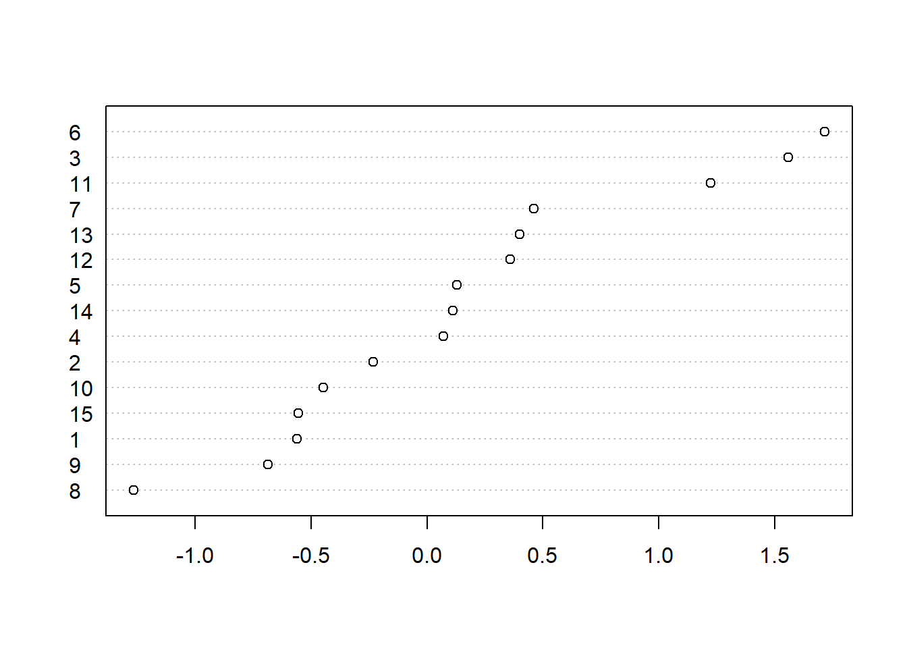
  
## Bar charts
  
Bar charts are used to visualize **categorical or discrete data**. They are suitable for representing data with distinct categories or groups, such as types of gene expression levels by tissue types (i.e., liver, heart, brain) or protein abundance levels by experimental conditions (i.e., control, treatment A, treatment B). In R, we use the `barplot()` function to create bar charts: 
    

``` r
group <- c("A","B","C")
count <- c(20, 50, 30)
barplot(height = count, names.arg =group,density = c(5,30,70), border = 3)
```

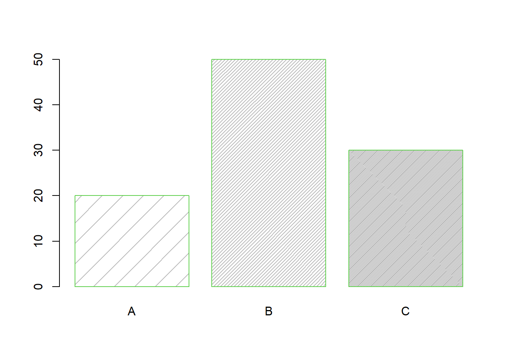
  
In this example, each group (i.e., A, B, C) is represented by a separate bar, and the height of each bar represents the count associated with that group. Notice that the bars are distinct and separate, with gaps between them.
  
### Key characteristics 
  
*  Bar charts are used to **compare values between different categories or groups**. They help identify trends, differences, or rankings among categories.
* In the x-axis, each category or group is represented by a separate bar. Each bar corresponds to a unique category, making it easy to compare values across different categories.
* The length or height of each bar represent the specific value or count associated to each category. 
  
### Customization
  
Customization arguments are similar to those explained in the line chart section. For more information, explore the help page in R. 
  

``` r
  ??graphics::barplot
```
  
### Multiple bar plots 
  
Bar plots are also useful to visualized counts across several groups and sub-groups. Let's create a dataset containing gene expression data for two genes (Gene A and Gene B) measured in three different experimental conditions (Control, Treatment A, Treatment B).


``` r
# Create a matrix of expression data
genes <- c("Gene A", "Gene B")
conditions <- c("Control", "Treatment A", "Treatment B")
expression_matrix <- matrix(
  c(
    25, 30, 22,
    15, 18, 28
  ),
  nrow = length(genes),
  ncol = length(conditions),
  byrow = TRUE,
  dimnames = list(genes, conditions)
)

# Display the expression matrix
expression_matrix
```

```
##        Control Treatment A Treatment B
## Gene A      25          30          22
## Gene B      15          18          28
```

With this data, you can create a bar chart to visualize how the expression levels of these two genes vary across the three different experimental conditions.


``` r
barplot(expression_matrix, col=c("slateblue3","orchid1"),
        main = "Gene Expression Levels by Condition",
        xlab = "", ylab = "Expression Level", 
        legend.text = TRUE, args.legend = list(x = "topright"))
```

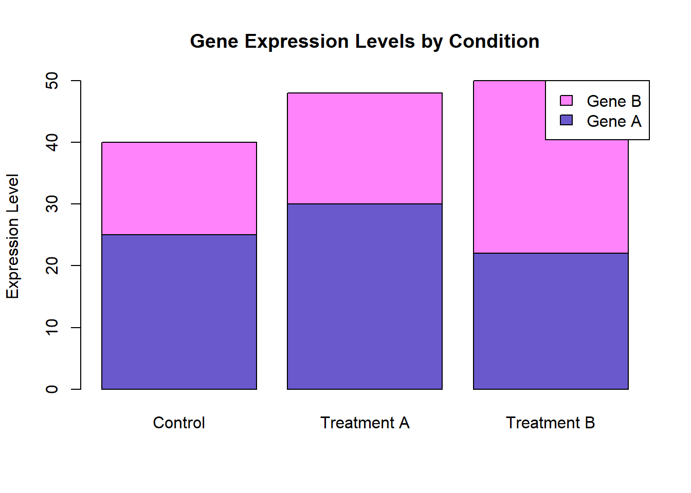

You can use the argument `beside = T` to have a clearer representation of the expression level for each gene under each specific condition. 


``` r
barplot(expression_matrix, beside = TRUE, col=c("slateblue3","orchid1"),
        main = "Gene Expression Levels by Condition",
        xlab = "", ylab = "Expression Level", ylim= c(0,45),
        legend.text = TRUE, args.legend = list( x= 9,y=43))
```

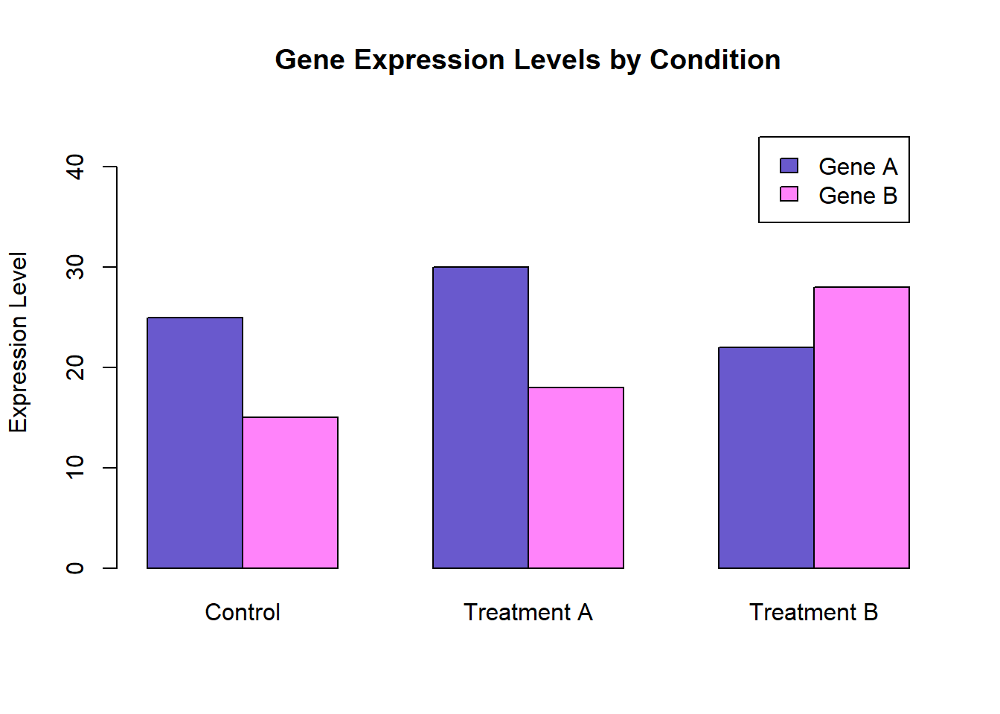

## Histograms

Histograms are used in statistics and data analysis to visualize the distribution of **continuous or numerical discrete data**. They provide a way to understand the underlying patterns and characteristics of a dataset. In R, we use `hist()` for creating histograms: 


``` r
hist(x, col = 5)  
```

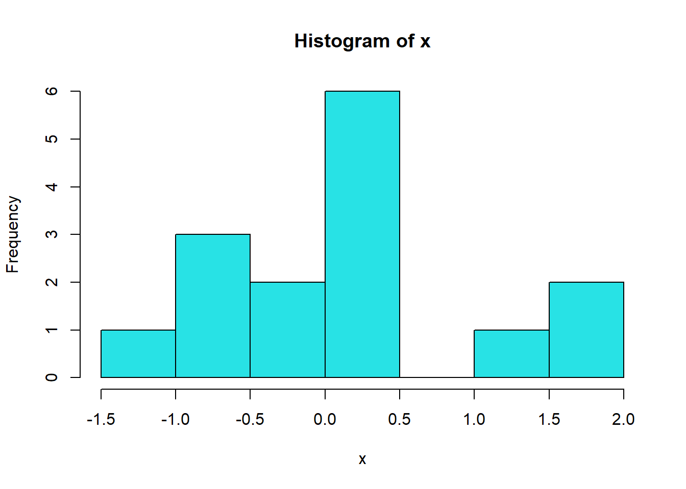

This basic function generates a histogram for the numeric vector x. By default, it includes a title and x-axis label based on the variable name. We can also represent the distribution of a vector of discrete data "z".


``` r
set.seed(321)
z <- rpois(1000,5)
table(z)
```

```
## z
##   0   1   2   3   4   5   6   7   8   9  10  11  12  13  14 
##   6  21  84 155 170 157 157 102  70  44  19   8   4   2   1
```

``` r
hist(z, col = "royalblue1",)
```

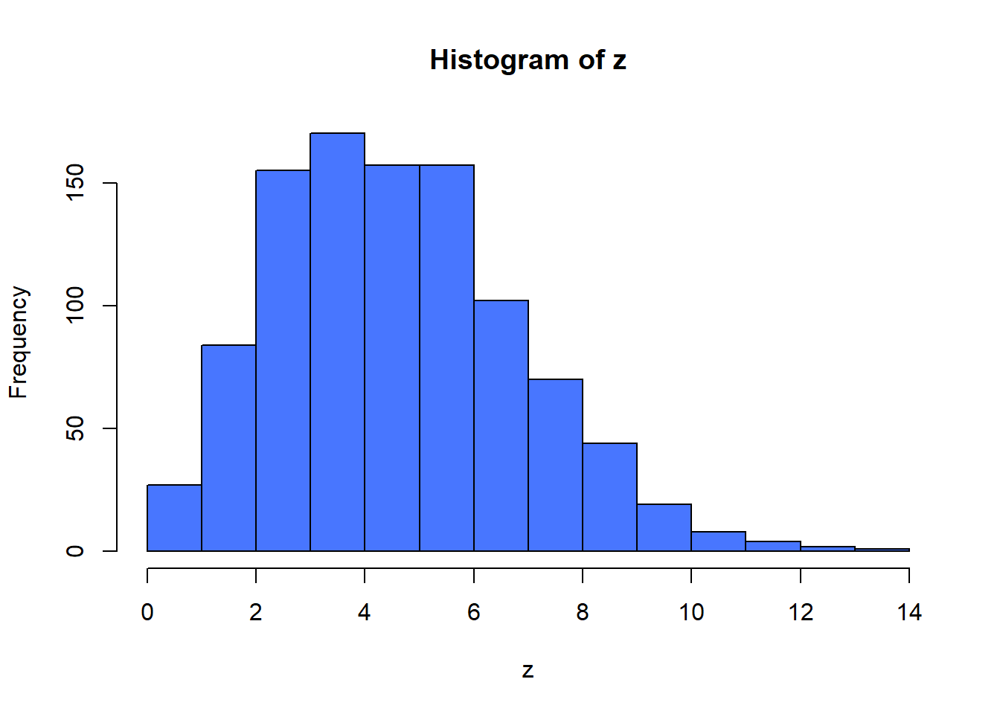


### Key characteristics

* Histograms display the **distribution** of a continuous or discrete numerical variable. This variable is typically plotted on the horizontal (x) axis. 
* The range of values of the numerical variable is divided into intervals or bins. Each bin represents a specific range of values.
* For each bin, the height of the bar represents the frequency or count of data points that fall into that bin. In other words, it shows how many data points belong to each interval.
* For continuous data, bins are usually contiguous intervals along the numerical range (e.g., age intervals such as 0-10, 10-20, etc.).
For discrete data, each unique value is treated as a separate bin.

### Customization

Customization arguments are similar to those explained in the line chart section. For more information, explore the help page in R. 


``` r
??graphics::hist
```

## Boxplot

Boxplots, also known as box-and-whisker plots, are used to visualize the **distribution** of data and identify potential outliers. They display the median, quartiles, and possible outliers of a dataset. In R, we use the`boxplot()` function: 


``` r
boxplot(x)
title("boxplot of x", ylab="x") 
```

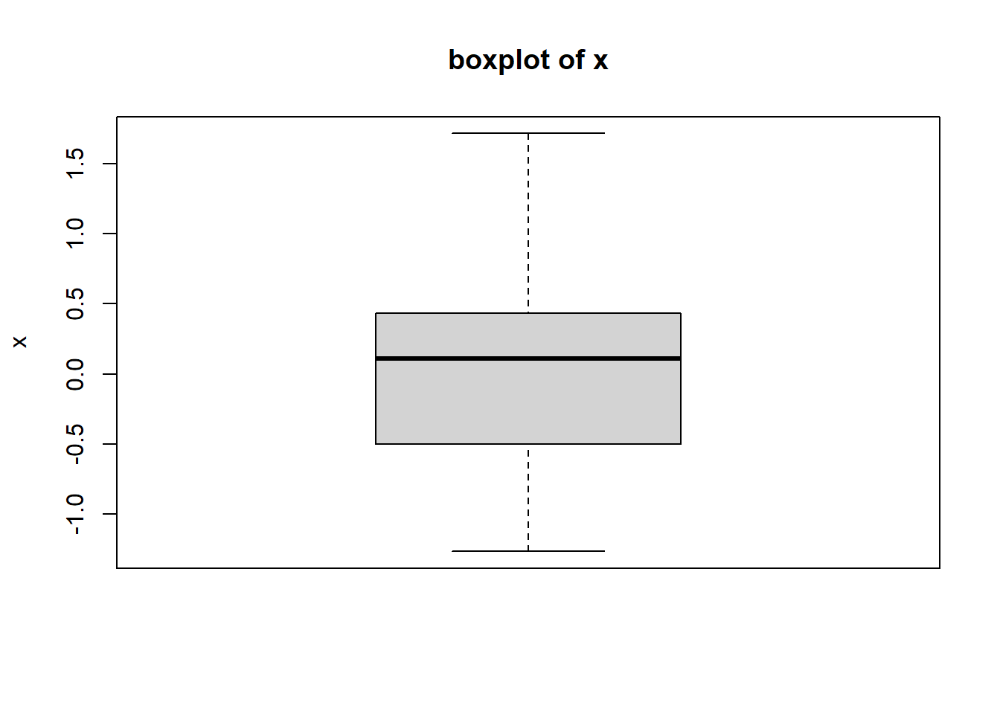

### Key characteristics 

1. **Univariate Representation:** Box plots are designed to visualize a single numerical variable ('x') at a time.

2. **Summary Statistics:** They provide a summary of the distribution of data, including the median, quartiles, and potential outliers.

3. **Visualizing Spread:** The box in the plot represents the interquartile range (IQR), while the "whiskers" extend to the data's range. Outliers are typically marked individually.

### Use cases
* **Distribution summary:** summarize central tendency, variability, identify outliers
* **Comparing groups:** compare the distribution of a numerical variable across different groups. 
* **Spotting Skewness:** a skewed distribution will have a longer tail on one side.

### Customization options

* `horizontal`: If `TRUE`, creates horizontal boxplots. 
* `outline`: If `FALSE`, hides outliers.
* `at`: Determines the x-coordinates of the boxplots when plotting multiple groups. Example: at = c(1, 2, 3) to specify positions for three boxplots.
* `names`: Assigns names to the boxplot groups. Example: names = c("Group A", "Group B", "Group C")
* `legend`: Add a legend for multiple boxplots.


``` r
# Sample data for multiple boxplots
data <- list(group1 = rnorm(50), group2 = rnorm(50), group3 = rnorm(50))

# Customize and create boxplots
boxplot(data, col = c("red", "blue", "green"),
        main = "Customized Boxplots",
        xlab = "Groups", ylab = "Values",
        names = c("A", "B", "C"))
```

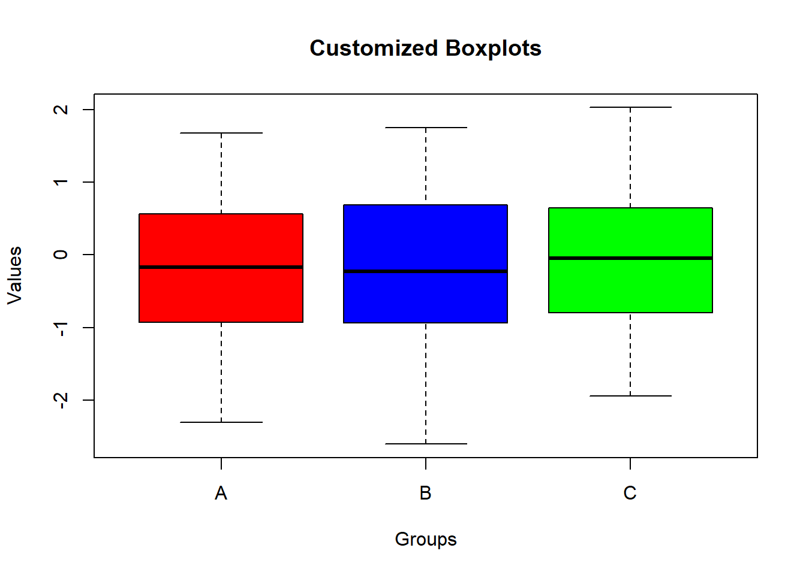

## Commbining different plots
This is an example of a plot containing both a histogram and a boxplot:
  

``` r
hist(x,main='histogram and boxplot of x',xlab='x',ylim=c(0,12))
```

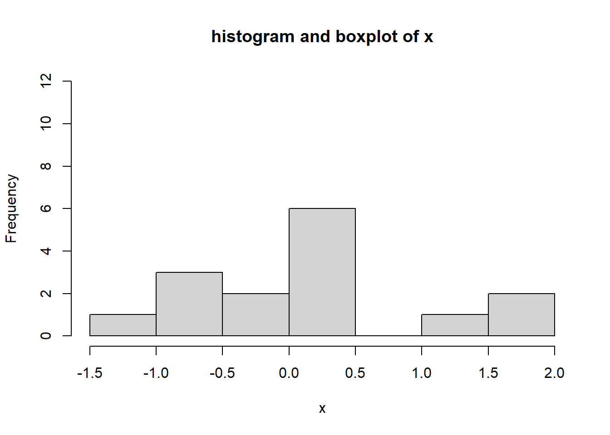

`add=T` : this allows the addition of the boxplot in the histogram

`axes=F`: we remove the axes of the boxplot


``` r
hist(x,main='histogram and boxplot of x',xlab='x',ylim=c(0,12)) 
boxplot(x,horizontal=TRUE,at=10,add=TRUE,axes=FALSE)
```

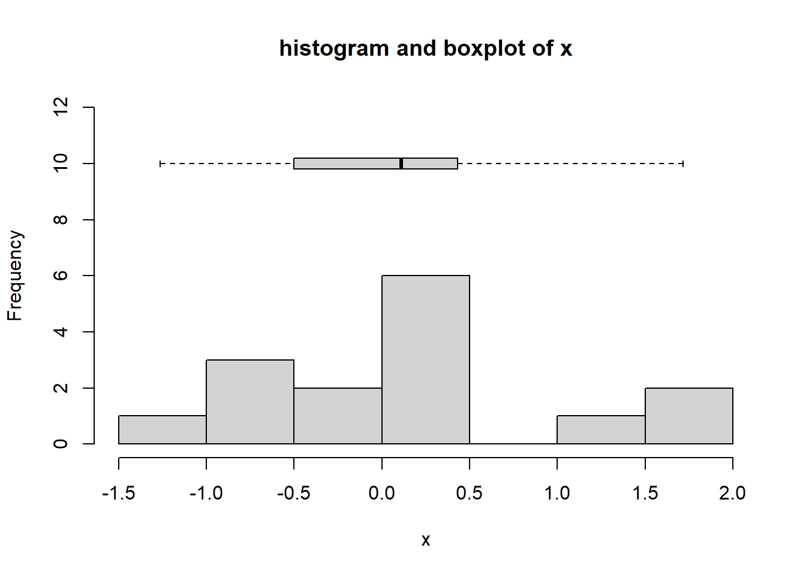

`boxwex`: specifies the width of the box

``` r
hist(x,main='histogram and boxplot of x',xlab='x',ylim=c(0,12)) 
boxplot(x,horizontal=TRUE,at=10,add=TRUE,axes=FALSE, boxwex = 5)
```

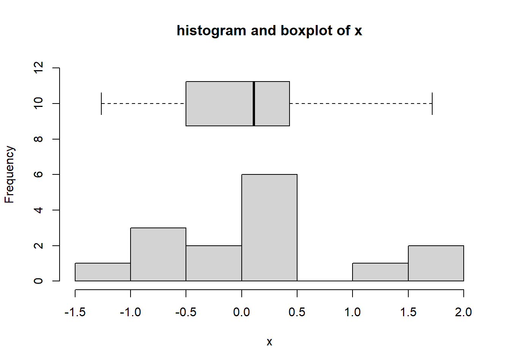


## Scatter Plots

A scatter plot is a graphical representation that helps visualize the relationship between two numerical variables. It displays individual data points as dots on a **two-dimensional** plane, where one variable is plotted on the x-axis, and the other is plotted on the y-axis. Scatter plots are especially useful for identifying patterns, correlations, and outliers in data.

### Creating a Simple Scatter Plot

To create a basic scatter plot in R, you can use the `plot()` function, providing two vectors for the x and y axes. Here's an example using a simple mathematical relationship between `x` and `y`:


``` r
# Generate data
x 
```

```
##  [1] -0.56047565 -0.23017749  1.55870831  0.07050839  0.12928774  1.71506499
##  [7]  0.46091621 -1.26506123 -0.68685285 -0.44566197  1.22408180  0.35981383
## [13]  0.40077145  0.11068272 -0.55584113
```

``` r
y <- x^2   # Define y as the squared values of x
plot(x,y, main = "Scatter plot x and y")
```

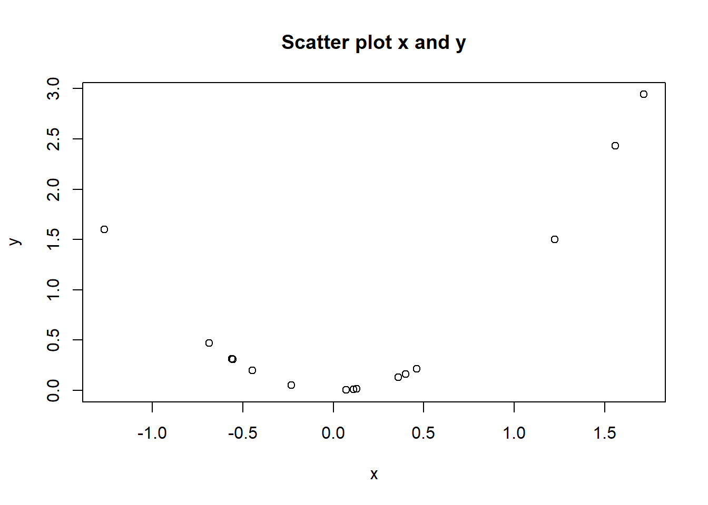

In this example, `x` and `y` are vectors representing the x and y coordinates of the data points. The `plot(x, y)` command generates a scatter plot with `x` values on the x-axis and corresponding `y` values on the y-axis. 

### Add new data to an existint plot

In data visualization, it's often necessary to add additional data or customize your scatter plots for clarity and insight. In this section, we'll explore how to improve existing scatter plots. You can use `points()` to add additional points to an existing plot


``` r
plot(x,y)
x1 <- c(-1,1)  # we add points x=1 and x=-1
y1 <- x1^2
points(x1,y1,col=2, pch=3)
```

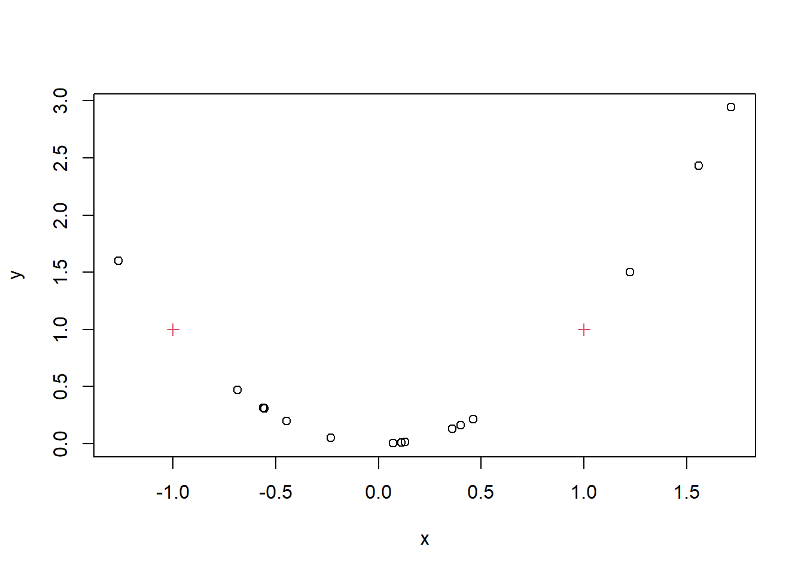

In this example, we first create a scatter plot (`plot(x, y)`) and then add new data points (`x1` and `y1`) to the plot using `points()`.

### Adding labels to data points 
To add labels to data points, you can use the `text()` function. Here's how to do it: 
  

``` r
plot(x,y)
points(x1,y1,col=2, pch=4) 
text(x1+0.1, y1+0.2, col=2, c("A", "B"))
```

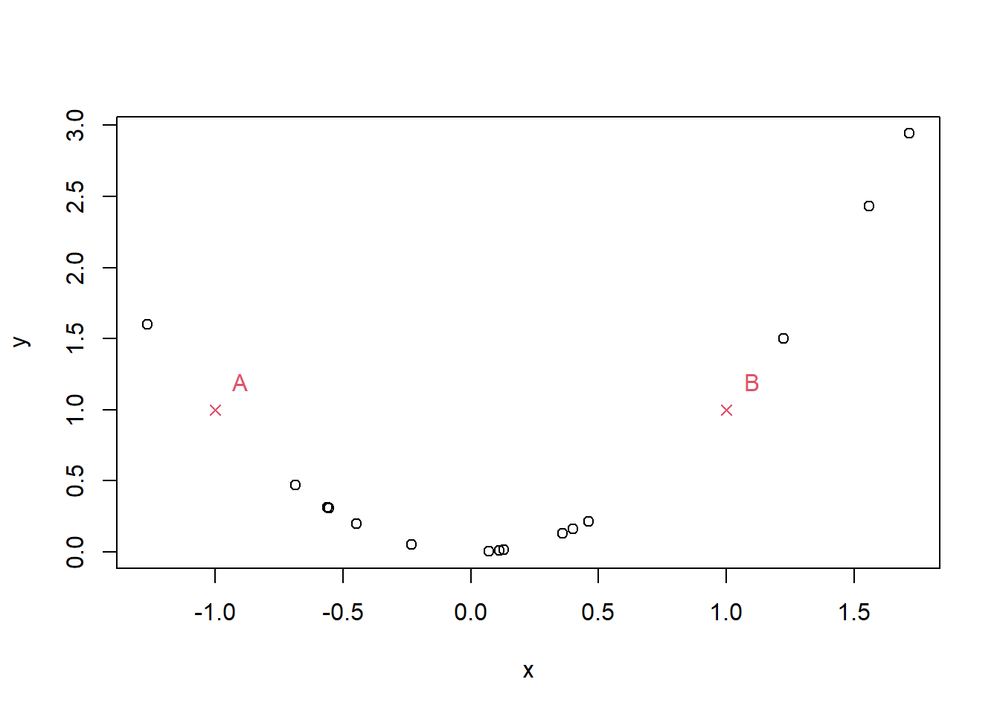

In this example, we added labels "A" and "B" to the new data points at positions (`x1 + 0.1`, `y1 + 0.2`).

### Using legends 

Legends are helpful for identifying different data series within a plot. You can use the `legend()` function to add legends to your scatter plot. Here's an example:

``` r
plot(x,y)
points(x1,y1,col=2, pch=4) 
legend(-1,2,c("Original","new"),col=c(1,2),pch=c(1,4))
```

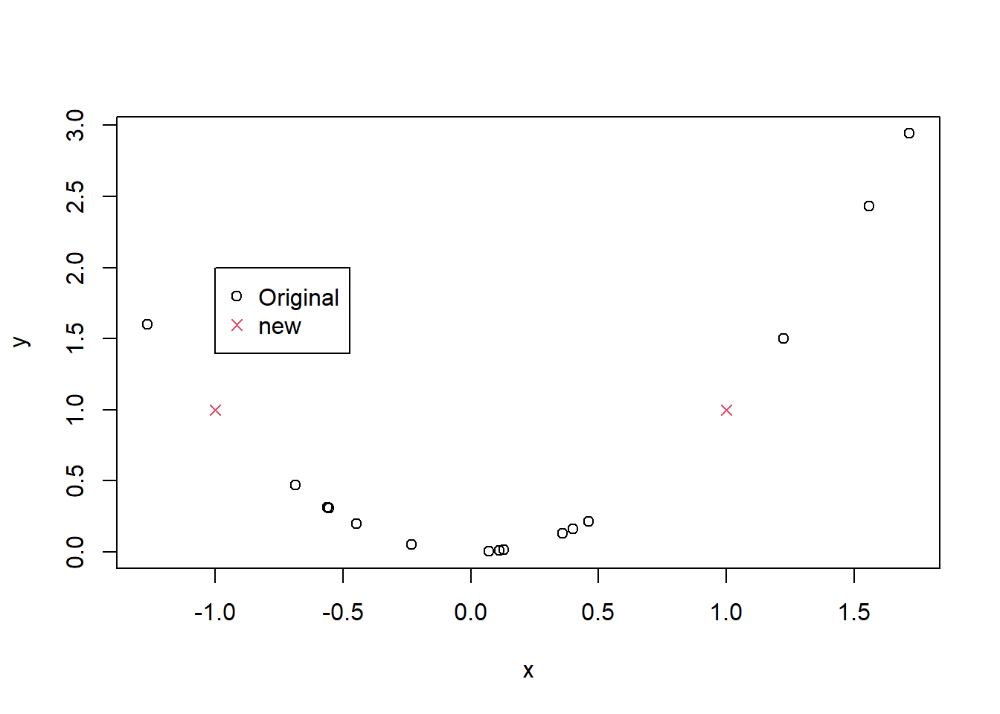

In this example, we placed the legend at coordinates (-1, 2) and labelled the original data as "Original" and the new data as "New".

### Customizing Scatter plots 

Scatter plots offer various customization options to improve their appearance and readability. Here are some common customization parameters:

* `col.main`: Specifies the colour of the plot's title.
* `font.main`: Defines the font of the plot's title.
* `cex`: Controls the proportion of reduction or amplification of fonts.
* `axes=F`: remove axes
* `axis()`: define new axes
* `box()`: creates a box around the plot
* `ann=F`: removes annotation
* `lab`: define new lables
* `abline()`: abline(a,b) adds line y=a+bx 
* `lty`: type of line 

Let's see an example that incorporates some of these customizations:
  

``` r
plot(x,y,axes=FALSE)
points(x1,y1,col=2, pch=4) 
legend(-1,3,c("Original","new"),col=c(1,2),pch=c(1,4), cex=0.7)
axis(1,pos=c(-0.5,0),at=seq(-2,2,by=0.4))
axis(2,pos=c(-1.5,-0.5),at=seq(0,3,by=0.5))
title("scatter plot", col.main = 3, font.main=3)
abline(1, -0.7, lty=3)
box()
```

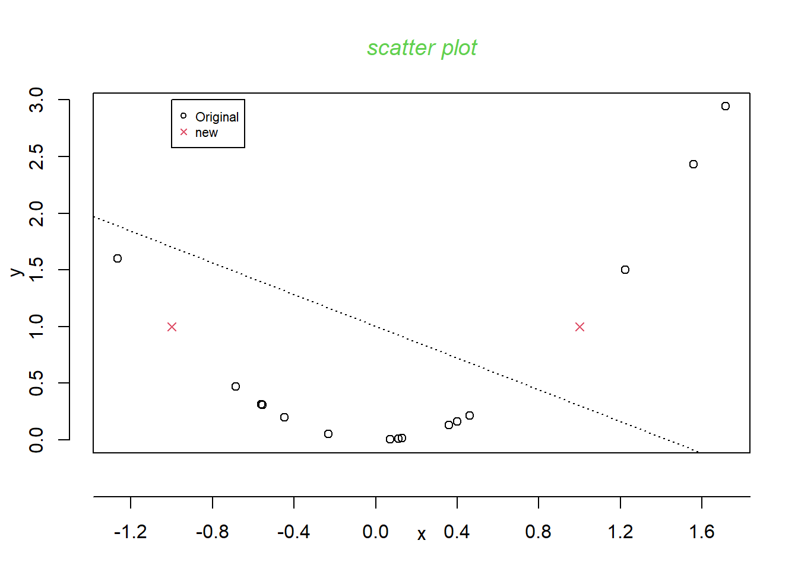


### Multiple scatter plots

We can use `pairs()` to create scatter plots of all pair of variables in a data frame (symmetric matrix of plots).


``` r
set.seed(123)
data<-data.frame(x1=runif(10), x2=runif(10), x3=runif(10), x4=runif(10))
pairs(data)
```

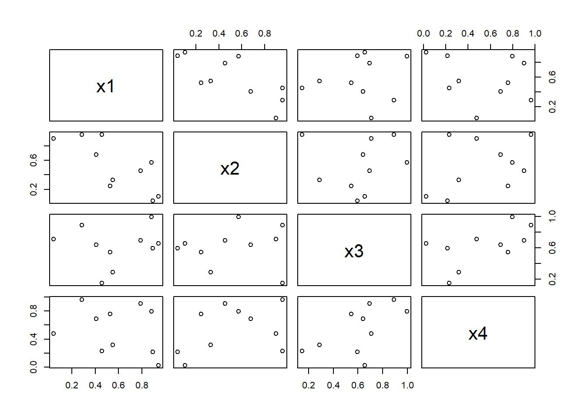


## Important graphical functions and parameters

* `par()`: set graphical parameters
* `mfrow`: number of pictures per row and column in a plot  
* `mar`: specifies the margin sizes around the plotting area in order: c(bottom, left, top, right)
* `dev.off()` shuts down the specified device

Before you change the graphical parameters it is convenient to store the default values. 


``` r
defaultpar<-par()
```

Explore the `par{graphics}` R Documentation to check main graphical parameters and easily access to other important functions and arguments. 

**Example:**
  

``` r
par(mfrow=c(2,3)) # puts 6 pictures in a plot distributed in 2 rows and 3 columns
hist(data$x1, main="Histogram x1")
hist(data$x2, main="Histogram x2")
hist(data$x3, main="Histogram x3")
boxplot(data$x1, main="Boxplot x1")
boxplot(data$x2, main="Boxplot x2")
boxplot(data$x3, main="Boxplot x3")
```

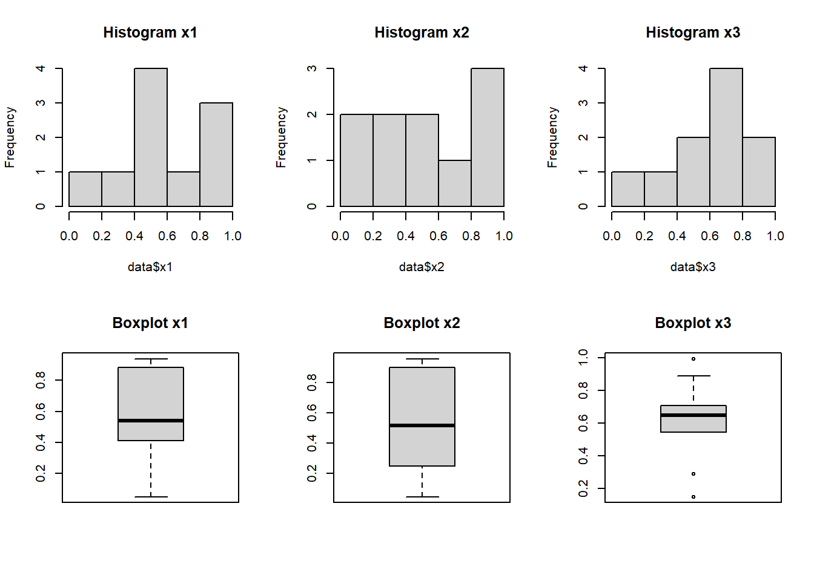


``` r
par(defaultpar)  # reset the default graphical parameters
```


## Saving Graphics to Files

`pdf()` redirect the plots to a pdf file. Similarly: `jpeg`, `png`, `ps`, `tiff`. After saving the image, don't forget to use dev.off() to close the device and finalize the saving process.

**Example:**


``` r
pdf("color_chart.pdf")  # creates a pdf file containing the following plot

plot(1, 1, xlim=c(1,5.5), ylim=c(0,7), type="n", ann=FALSE)
text(x = 1:5, y = rep(6.2,5), labels=c(0:4), cex=1:5, col=1:5)
points(x = 1:5, y = rep(5,5), cex=1:5, col=1:5, pch=0:4)
text((1:5)+0.4, rep(5,5), cex=0.6, (0:4)) ## labels = 0:4
points(1:5, rep(4,5), cex=2, pch=(5:9))
text((1:5)+0.4, rep(4,5), cex=0.6, (5:9))
points(1:5, rep(3,5), cex=2, pch=(10:14))
text((1:5)+0.4, rep(3,5), cex=0.6, (10:14))
points(1:5, rep(2,5), cex=2, pch=(15:19))
text((1:5)+0.4, rep(2,5), cex=0.6, (15:19))
points((1:6)*0.8+0.2, rep(1,6), cex=2, pch=(20:25))
text((1:6)*0.8+0.5, rep(1,6), cex=0.6, (20:25))


dev.off()
```


