# SECTION 10. Advanced Data Visualization: ggplot2 package


`ggplot2` is an R package for producing statistical, or data, graphics, but it is unlike most other graphics packages because it has a deep underlying code. This code is composed of a set of independent components that can be composed in many different ways. `ggplot2` is designed to work in a layered fashion, starting with a layer showing the raw data then adding layers of annotation and statistical summaries.


## Why ggplot2?

Advantages of ggplot2

* consistent underlying grammar of graphics 

* plot specification at a high level of abstraction

* very flexible

There are a lot of cheatsheets and sources that allow us to find examples and code to plot more advanced graphics with ggplot. We will start step by step.


## Installation


``` r
install.packages("ggplot2")
library(ggplot2)
```

(You'll need to make sure you have the most recent version of R to get the most recent version of ggplot)


## Usage

It's hard to describe how ggplot2 works because it embodies a deep philosophy of visualization. However, in most cases you start with `ggplot()`, supply a dataset and aesthetic mapping (with `aes()`). 


## Geometric Objects And Aesthetics

### Aesthetic Mapping

In ggplot land aesthetic means "something you can see". Examples include:

* position (i.e., on the x and y axes)

* color ("outside" color)

* fill ("inside" color)

* shape (of points)

* linetype

* size

Each type of geom accepts only a subset of all aesthetics-refer to the geom help pages to see what mappings each geom accepts. Aesthetic mappings are set with the `aes()` function.

### Geometic Objects (geom)

Geometric objects are the actual marks (different visual object to represent the data) we put on a plot. Examples include:

* points (`geom_point`, for scatter plots, dot plots, etc)

* lines (`geom_line`, for time series, trend lines, etc)

* boxplot (`geom_boxplot`, for, well, boxplots!)

* barplot (`geom_bar`, for barplots)

A plot must have at least one geom; there is no upper limit. You can add a geom to a plot using the `+` operator. You can get a list of available geometric objects using the code below:


``` r
help.search("geom_", package = "ggplot2")
```

The `ggplot()` function is used to **initialize the basic graph structure**, then we add to it. The basic idea is that you specify different parts of the plot, and add them together using the `+` operator. These parts are often referred to as layers.


**`ggplot2` requires a data frame as input.**

Let's start: 


## Examples

Install and Load the ggplot2 package. Explore the `diamonds` dataset. The diamonds data frame contains information on the prices and various metrics of $~54,000$ diamonds.


``` r
library(ggplot2)
names(diamonds)
```

```
##  [1] "carat"   "cut"     "color"   "clarity" "depth"   "table"   "price"  
##  [8] "x"       "y"       "z"
```

``` r
dim(diamonds)
```

```
## [1] 53940    10
```

We can check the class of each one of the variables:


``` r
head(diamonds)
```

```
## # A tibble: 6 × 10
##   carat cut       color clarity depth table price     x     y     z
##   <dbl> <ord>     <ord> <ord>   <dbl> <dbl> <int> <dbl> <dbl> <dbl>
## 1  0.23 Ideal     E     SI2      61.5    55   326  3.95  3.98  2.43
## 2  0.21 Premium   E     SI1      59.8    61   326  3.89  3.84  2.31
## 3  0.23 Good      E     VS1      56.9    65   327  4.05  4.07  2.31
## 4  0.29 Premium   I     VS2      62.4    58   334  4.2   4.23  2.63
## 5  0.31 Good      J     SI2      63.3    58   335  4.34  4.35  2.75
## 6  0.24 Very Good J     VVS2     62.8    57   336  3.94  3.96  2.48
```

``` r
str(diamonds)
```

```
## tibble [53,940 × 10] (S3: tbl_df/tbl/data.frame)
##  $ carat  : num [1:53940] 0.23 0.21 0.23 0.29 0.31 0.24 0.24 0.26 0.22 0.23 ...
##  $ cut    : Ord.factor w/ 5 levels "Fair"<"Good"<..: 5 4 2 4 2 3 3 3 1 3 ...
##  $ color  : Ord.factor w/ 7 levels "D"<"E"<"F"<"G"<..: 2 2 2 6 7 7 6 5 2 5 ...
##  $ clarity: Ord.factor w/ 8 levels "I1"<"SI2"<"SI1"<..: 2 3 5 4 2 6 7 3 4 5 ...
##  $ depth  : num [1:53940] 61.5 59.8 56.9 62.4 63.3 62.8 62.3 61.9 65.1 59.4 ...
##  $ table  : num [1:53940] 55 61 65 58 58 57 57 55 61 61 ...
##  $ price  : int [1:53940] 326 326 327 334 335 336 336 337 337 338 ...
##  $ x      : num [1:53940] 3.95 3.89 4.05 4.2 4.34 3.94 3.95 4.07 3.87 4 ...
##  $ y      : num [1:53940] 3.98 3.84 4.07 4.23 4.35 3.96 3.98 4.11 3.78 4.05 ...
##  $ z      : num [1:53940] 2.43 2.31 2.31 2.63 2.75 2.48 2.47 2.53 2.49 2.39 ...
```


We will structure this "Examples" section by showing different types of graphics based on our **main goal** and the **type of variables** that we want to work with:


If we want to analyze:

* Frequency (categorical variable): barplot (e.g. Cut from diamonds)

* Part of a whole (two categorical variables: proportion of observations of one variable's categories among the categories of a second variable): stacked/grouped barplot (e.g. Cut-color from diamonds)

* Distribution (continuous variable): histogram, boxplot, density plot (e.g. depth, price, x.... from diamonds)

* Correlation (2 continuous variables): scatter plot


There are more options that we would like to analyze/explore. 

In case you want to learn about other graphics/options, visit the following link: https://r-graph-gallery.com/ . You will find a wide range of options to graphically describe your data. 


### Categorical Variables


#### Barplot

We have a categorical variable and we want to find the frequency of appearance for each level of the factor. The main idea is to plot the frequency that we observe for each category of the categorical variable (**check class(Variable)**: it must be a factor). 


``` r
table(diamonds$cut)
```

```
## 
##      Fair      Good Very Good   Premium     Ideal 
##      1610      4906     12082     13791     21551
```

``` r
ggplot(diamonds, aes(x=cut)) +
  geom_bar()
```


Using pipes we can proceed as follows:


``` r
diamonds %>% ggplot(aes(x=cut)) +
  geom_bar()
```


Imagine that we want to fill each bar with a color according to each category of the variable cut


``` r
ggplot(diamonds, aes(x=cut)) +
  geom_bar(aes(fill=cut))
```


``` r
##same if we do: ggplot(diamonds, aes(x=cut,fill=cut)) +  geom_bar()
```


Now we want to display the result of the table of contingency relating cut*color. 

We want to see how many observations for each category of the variable cut do we have but stratifying by color. 


``` r
table(diamonds$cut, diamonds$color)
```

```
##            
##                D    E    F    G    H    I    J
##   Fair       163  224  312  314  303  175  119
##   Good       662  933  909  871  702  522  307
##   Very Good 1513 2400 2164 2299 1824 1204  678
##   Premium   1603 2337 2331 2924 2360 1428  808
##   Ideal     2834 3903 3826 4884 3115 2093  896
```

``` r
##stacked
ggplot(diamonds, aes(x=cut, fill=color)) +
  geom_bar(position = "stack") 
```


``` r
##not stacked
ggplot(diamonds, aes(x=cut, fill=color)) +
  geom_bar(position = "dodge")
```


If we want to display within group the relative proportion of each type of color?


``` r
ggplot(diamonds, aes(x=cut, fill=color)) +
  geom_bar(position = "fill")
```


``` r
##when adding + scale_y_continuous(labels = scales::percent_format()) we can see the y-axis as percent (x out of 100%).
```


* how to change the coordinates of the plot? Use `coord_flip()`


``` r
ggplot(diamonds, aes(x=cut, fill=color)) +
  geom_bar(position = "dodge") + 
  coord_flip()
```


### Quantitative Variables

#### Distribution

##### Histograms

Let's plot the distribution of the variable *price*. 


``` r
ggplot(data=diamonds) +
  geom_histogram(binwidth=500, aes(x=price)) +     ##### binwidth=change width histogram
  ggtitle("Diamond Price Distribution") +
  xlab("Diamond Price U$ - Binwidth 500") + 
  ylab("Frequency") +
   xlim(0,2500)
```

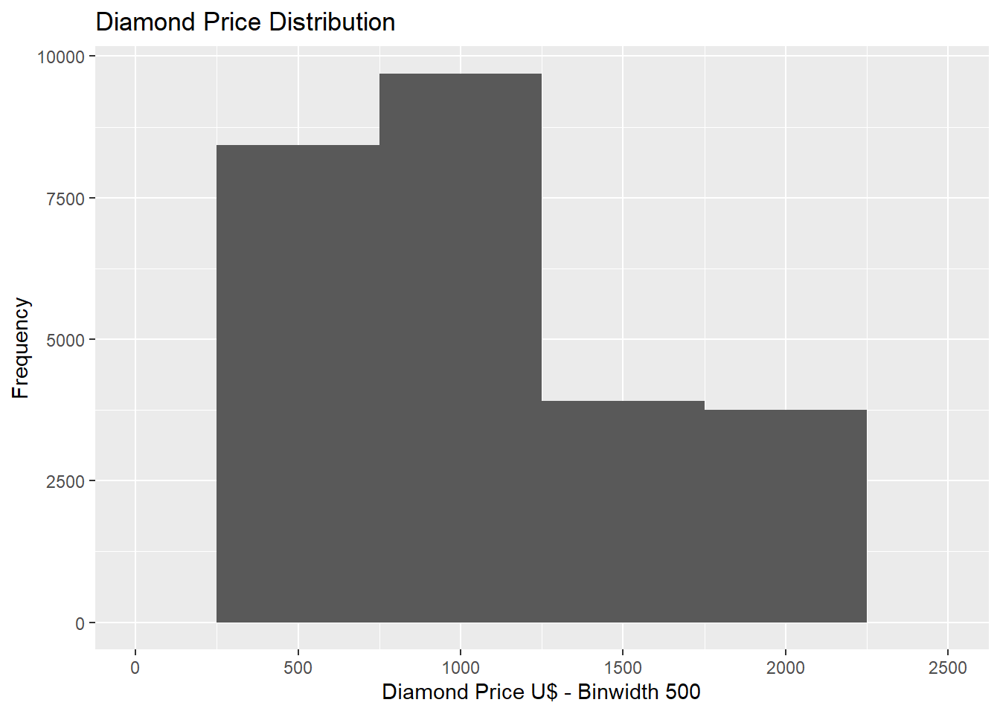

``` r
##let's see at different levels


p1<-ggplot(data=diamonds) +
  geom_histogram(binwidth=50, aes(x=price)) +     ##### binwidth=change width histogram
  ggtitle("Diamond Price Distribution") +
  xlab("Diamond Price U$ - Binwidth 50") + 
  ylab("Frequency") +
   xlim(0,2500)

p2<- ggplot(data=diamonds) +
  geom_histogram(binwidth=10, aes(x=price)) +     ##### binwidth=change width histogram
  ggtitle("Diamond Price Distribution") +
  xlab("Diamond Price U$ - Binwidth 10") + 
  ylab("Frequency") +
   xlim(0,2500) 

##warning because our maximum value in the x-axis is lower than the maximum value of the variable price
##observations that are not plotted

library(ggpubr)
ggarrange(ncol=2, nrow=1, p1,p2) ## ggarrange allows us to plot together different plots: we can define number of columns (ncol) and number of rows(nrow) to divide the area where we want to add the plots
```


- How to customize our histogram?


**1) Color and fill **


``` r
ggplot(data=diamonds, aes(x=price)) +
  geom_histogram(binwidth=10, color="steelblue", fill="orange") +     
  ggtitle("Diamond Price Distribution") +
  xlab("Diamond Price U$ - Binwidth 10") + 
  ylab("Frequency") +
   xlim(0,2500) 
```

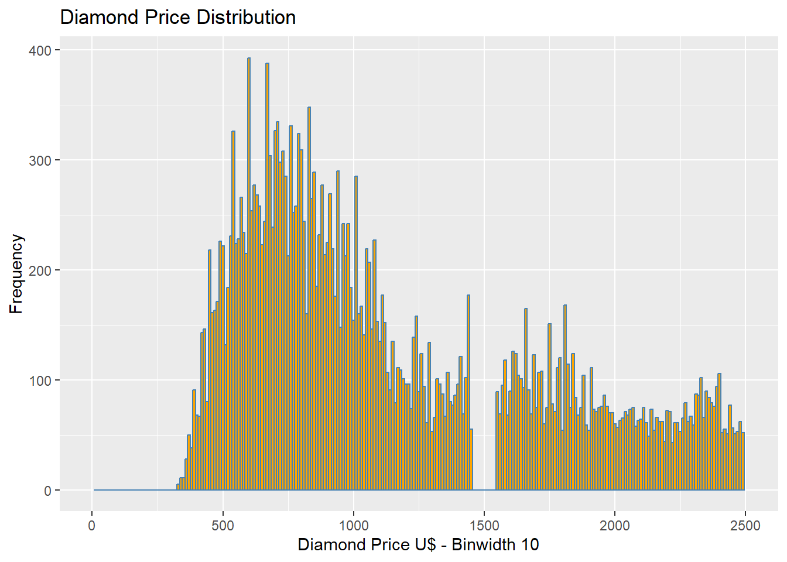


**2) Add mean line**

We well use the argument `geom_vline`where we can indicate that we want a vertical line (vline) where price takes the mean value. We will indicate it in the xintercept. The arguments *linetype* and *lwd* allow us to change the style (linetype) and width (lwd) of the line. 


``` r
ggplot(data=diamonds, aes(x=price)) +
  geom_histogram(binwidth=10, color="black", fill="steelblue") +     
  ggtitle("Diamond Price Distribution") +
  xlab("Diamond Price U$ - Binwidth 10") + 
  ylab("Frequency") +
 #  xlim(0,2500)  +
  geom_vline(aes(xintercept=mean(price)), color="red",linetype="dashed",lwd=2)
```

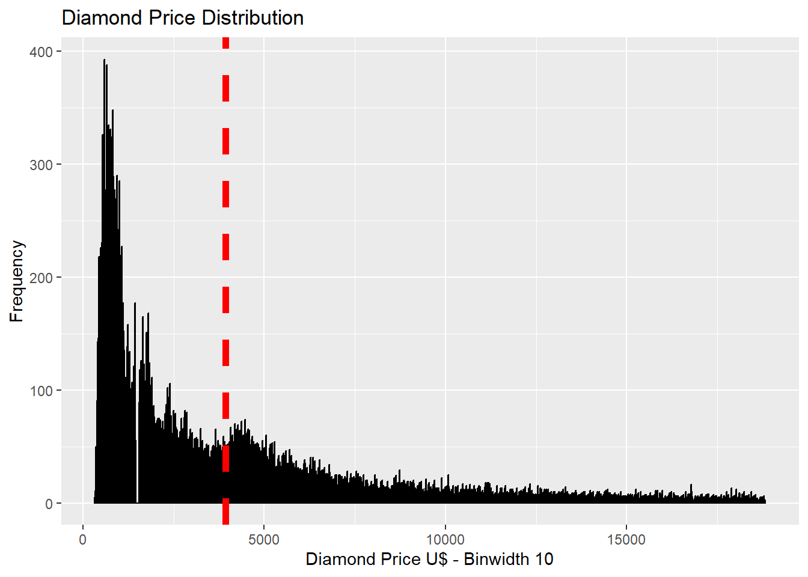


We can also use `geom_hline` with the argument `yintercept` to define an horizontal line. Imagine that we want to define an horizontal line when the frequency is above 200. 


``` r
ggplot(data=diamonds, aes(x=price)) +
  geom_histogram(binwidth=10, color="black", fill="steelblue") +     
  ggtitle("Diamond Price Distribution") +
  xlab("Diamond Price U$ - Binwidth 10") + 
  ylab("Frequency") +
 #  xlim(0,2500)  +
  geom_hline(aes(yintercept=200), color="red",linetype="dashed",lwd=1)
```

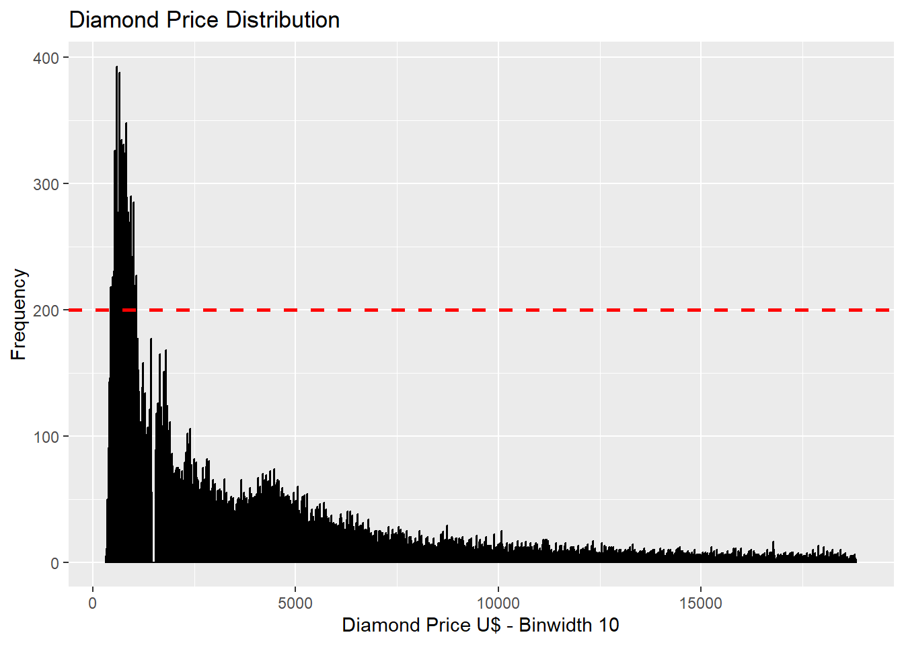


**3) Overlap two or more histograms: imagine that we want to plot the distribution of the variable *price* according to different categories. For example, based on the variable *cut* (has 5 categories). We will compare the distribution of the variable *price* among three of these categories: "Ideal", "Good" or "Fair".**


``` r
unique(diamonds$cut)
```

```
## [1] Ideal     Premium   Good      Very Good Fair     
## Levels: Fair < Good < Very Good < Premium < Ideal
```

``` r
table(diamonds$cut)
```

```
## 
##      Fair      Good Very Good   Premium     Ideal 
##      1610      4906     12082     13791     21551
```

``` r
ggplot(diamonds, aes(x=price)) +
  geom_histogram(data=subset(diamonds, diamonds$cut=="Ideal"),  binwidth=10, color="black", fill="orange") +
  geom_histogram(data=subset(diamonds, diamonds$cut=="Good"),  binwidth=10, color="black", fill="darkgreen") +
  geom_histogram(data=subset(diamonds, diamonds$cut=="Fair"),  binwidth=10, color="black", fill="red") +   
  ggtitle("Diamond Price Distribution by Cut") +
  xlab("Diamond Price U$ - Binwidth 10") + 
  ylab("Frequency") +
   xlim(0,2500) 
```

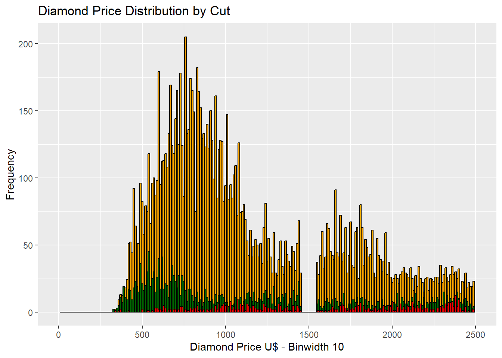


If we want to display the overlap among all categories for the variable `cut`:


``` r
ggplot(diamonds, aes(x=price)) +
  geom_histogram(binwidth=10, aes(fill=cut), colour="black") +
  ggtitle("Diamond Price Distribution by Cut") +
  xlab("Diamond Price U$ - Binwidth 10") + 
  ylab("Frequency") +
  xlim(0,2500) 
```

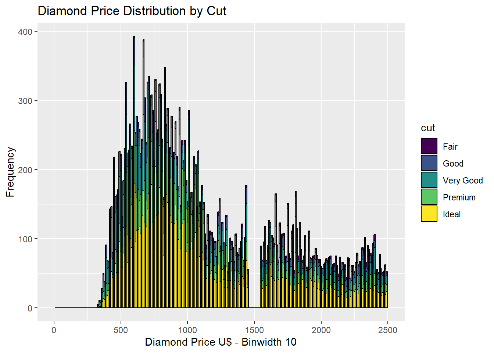

##### Density plots

We display the density plot only for the cases where price is below 1000. 


``` r
diamonds %>%
  filter( price<1000 ) %>%
  ggplot( aes(x=price)) +
    geom_density(fill="#69b3a2", color="#e9ecef", alpha=0.8)
```


Now for all the cases:


``` r
diamonds %>%
  ggplot( aes(x=price)) +
    geom_density(fill="#69b3a2", color="#e9ecef", alpha=0.8)
```

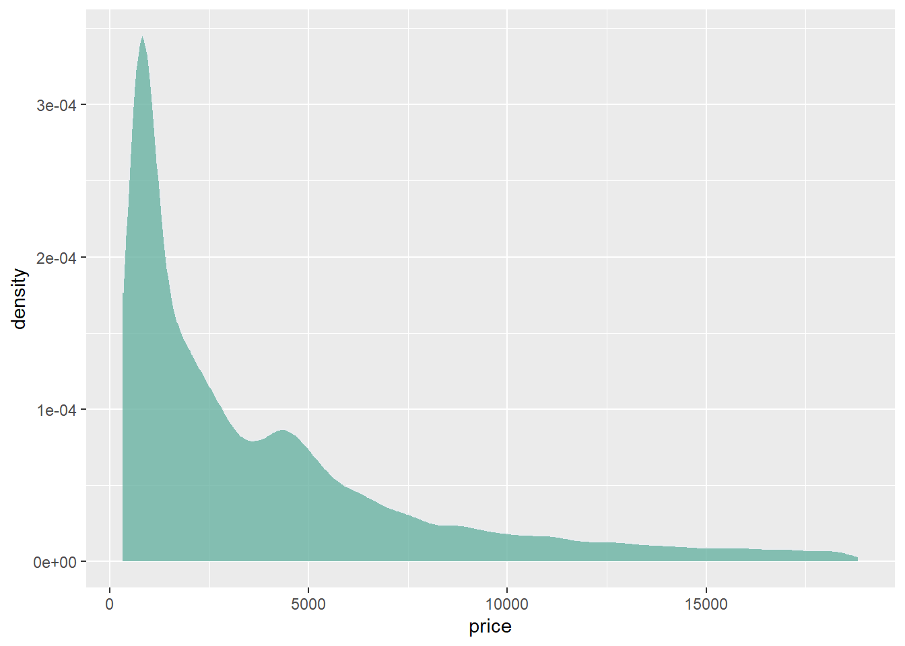


And stratifying by cut:


``` r
diamonds %>%
  ggplot( aes(x=price, fill=cut, color=cut)) +
    geom_density(alpha=0.8) ##color="gray"
```


---

##### Boxplots

When we want to observe the distribution of a continuous variable, we can use box plots in order to visualize the median of the distribution, the first and third quantile, the variability across all the observations and outliers.

We can plot these distributions stratifying by categorical variables, to compare between different categories of the same factor. 

In the previous section, we have seen the distribution of the variable *price* in a histogram that shows the range of prices that are more frequent in our sample. We have also plotted the observations according to specific levels of the factor *cut*. 

Now, we are not interested in the frequency but in the distribution of the variable *price*. 

**1)  We want to plot the distribution of the price for all the observations, without distinguishing by any condition:**


``` r
ggplot(diamonds, aes(x=factor(0),y=price)) +
 geom_boxplot() + ggtitle("Diamond Price") +  
 ylab("Diamond Price U$") +
 coord_cartesian(ylim=c(0,7500)) + 
  theme(axis.title.x=element_blank(),## removes title in the x-axis
        axis.text.x=element_blank(), ###removes text ===> 0 in the x-axis
        axis.ticks.x=element_blank()) ## removes the tick (line) 
```

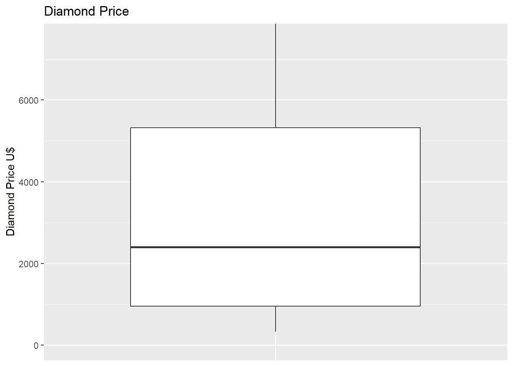


**2) We want to plot the distribution of the variable *price* for each one of the categories of the variable *cut*. We will fill each box according to the each level (cut).**


``` r
ggplot(diamonds, aes(x=cut,y=price, fill=cut)) +
 geom_boxplot() + ggtitle("Diamond Price") +  
 ylab("Diamond Price U$") +
 coord_cartesian(ylim=c(0,7500)) 
```

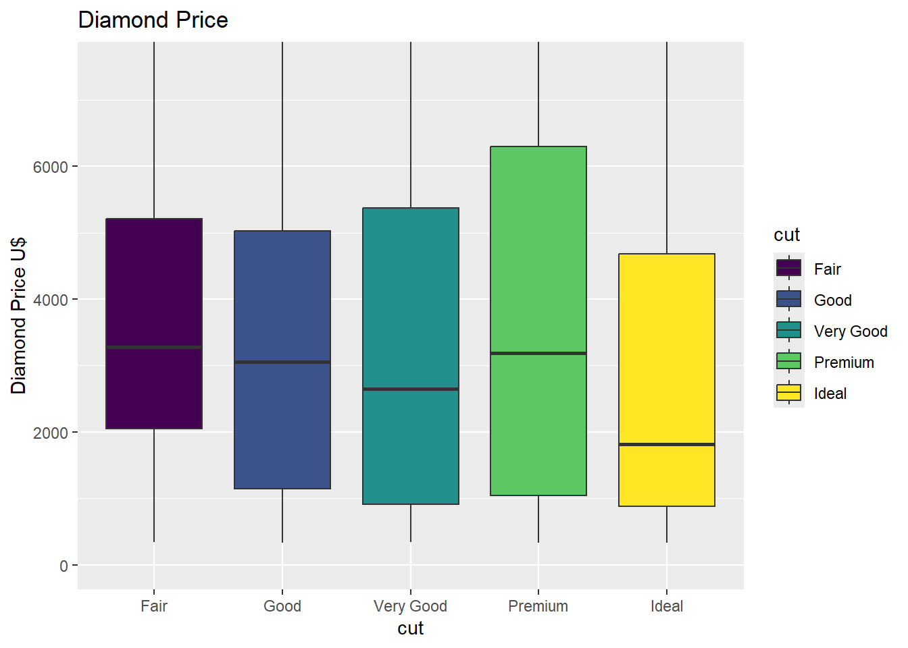


**3) If we want to remove the legend**


``` r
ggplot(diamonds, aes(x=cut,y=price, fill=cut)) +
 geom_boxplot() + ggtitle("Diamond Price") +  
 ylab("Diamond Price U$") +
 coord_cartesian(ylim=c(0,7500)) +
  theme(legend.position = "none")
```

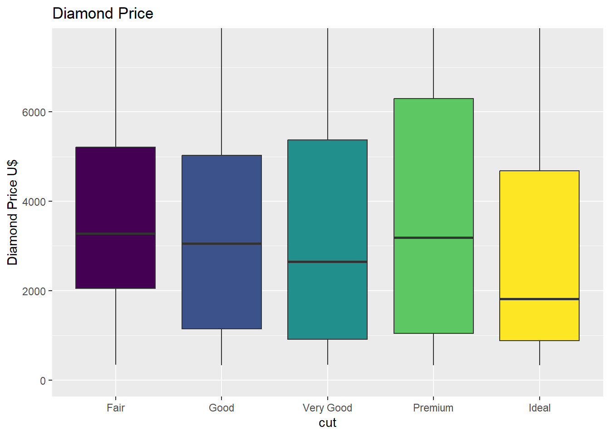


**4) If we want lighter colors**


``` r
ggplot(diamonds, aes(x=cut,y=price, fill=cut)) +
 geom_boxplot(alpha=0.3) + ggtitle("Diamond Price") +  
 ylab("Diamond Price U$") +
 coord_cartesian(ylim=c(0,7500)) 
```


**5) If we want to observe each one of the points (observations)**


``` r
ggplot(diamonds, aes(x=cut,y=price, fill=cut)) +
 geom_boxplot(alpha=0.6) +
  geom_jitter(color="black", alpha=0.3, 
              position=position_jitter(), size=0.6) + ### add points for each observation >> it                                                       allows us to find clusters of individuals
  ggtitle("Diamond Price") +  
 ylab("Diamond Price U$") +
 coord_cartesian(ylim=c(0,7500)) 
```


##### Violin plot


``` r
diamonds %>%
  ggplot( aes(x=cut,y=price, fill=cut)) +
    geom_violin(width=1.4) +
    geom_boxplot(width=0.1, color="gray", alpha=0.1) +
    theme_classic2() +
    theme(
      legend.position="none",
      plot.title = element_text(size=11)
    ) +
    ggtitle("A Violin wrapping a boxplot")
```

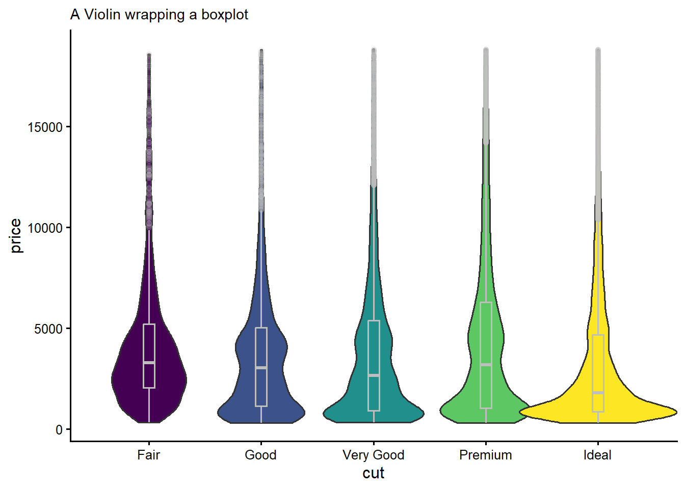


#### Correlation between 2 variables

##### Scatterplot

Now, we are interested in plotting together the observations of two continuous variables. For example, we want to assess the relationship between the variable depth and price:


``` r
p<-ggplot(diamonds, aes(x = depth, y = price)) + geom_point() 
p
```


Let's see the distribution of each variable:


``` r
p2<- ggMarginal(p,type="histogram")
p2
```

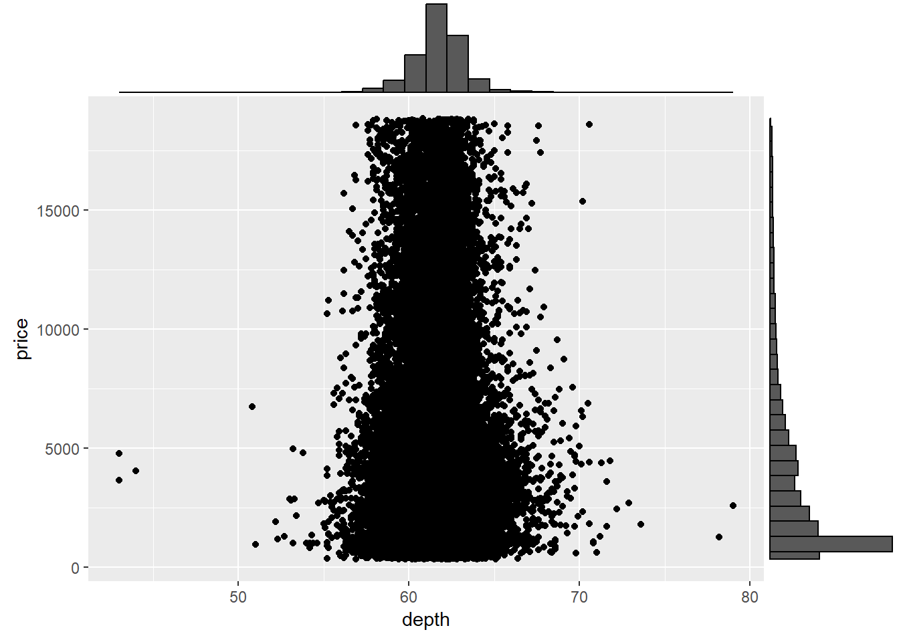


We can also assess the association between variables x and y:


``` r
ggplot(diamonds, aes(x = x, y = y)) + geom_point()
```


Let's graphically analayze the association between the *price* of a diamond and its *weight* (**carat**). In addition, we will color the points based on the quality of the *cut*. 


``` r
ggplot(diamonds, aes(x = carat, y = price, color=cut)) + geom_point()
```


- In this last situation we can be interested in performing a linear regression model to assess whether the weight of the diamond (carat) predicts its price. We can also plot the regression line and equation. We will color the observations based on the weight (explanatory variable) of each diamond.  


``` r
diamonds$pred.SC <- predict(lm(price ~ carat, data = diamonds)) ##same if we save the output of the model in a new object "r" => r<- lm(price ~ carat, data = diamonds) and then we select the fitted values => r$fitted.values

p1 <- ggplot(diamonds, aes(x = carat, y = price))


###ggplot2
p1 + geom_point(aes(color = carat)) + 
    geom_line(aes(y = pred.SC))
```

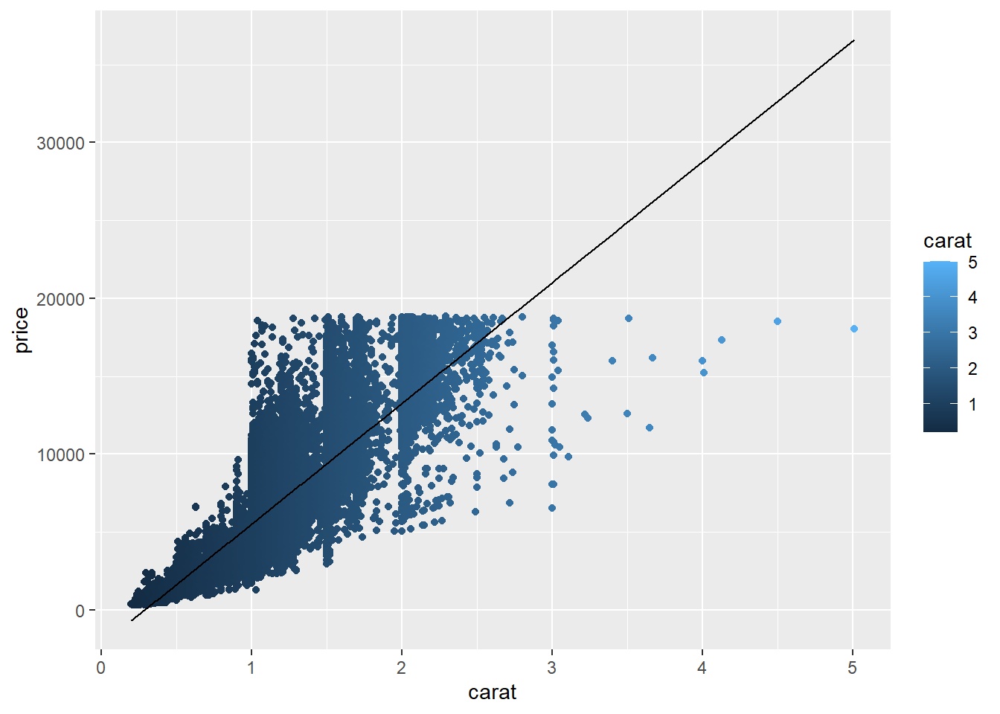


---

##### Smoothers

Not all geometric objects are simple shapes-the smooth geom includes a line and a ribbon.

We can define different methods, but by default it applies generalized additive models, for non-linear associations. It assumes that the outcome can be modelled by a sum of arbitrary functions of each feature. 

We can also assume linear association and define it in the argument metod.

Let's see the same example that we have seen in the previous section by using `geom_smooth` and adding the equation of the regression line.


``` r
library(ggpmisc)
## geom_smooth and lm

formula<- y~x

p1+ geom_point(aes(color = carat)) +
  geom_smooth(method = "lm", color="red",se = TRUE) + 
  
    ##method="lm" 
    ## se=F => do not show confidence bands
  
    stat_poly_eq(aes(label = paste(..eq.label.., ..rr.label.., sep = "~~~")), 
              formula = formula,  size = 7)
```

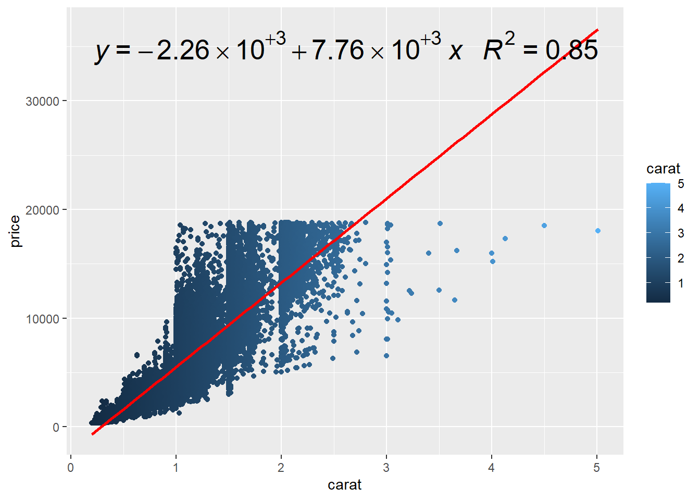


Let's check the output of the model:


``` r
model<-lm(price ~ carat, data = diamonds)
summary(model)
```

```
## 
## Call:
## lm(formula = price ~ carat, data = diamonds)
## 
## Residuals:
##      Min       1Q   Median       3Q      Max 
## -18585.3   -804.8    -18.9    537.4  12731.7 
## 
## Coefficients:
##             Estimate Std. Error t value Pr(>|t|)    
## (Intercept) -2256.36      13.06  -172.8   <2e-16 ***
## carat        7756.43      14.07   551.4   <2e-16 ***
## ---
## Signif. codes:  0 '***' 0.001 '**' 0.01 '*' 0.05 '.' 0.1 ' ' 1
## 
## Residual standard error: 1549 on 53938 degrees of freedom
## Multiple R-squared:  0.8493,	Adjusted R-squared:  0.8493 
## F-statistic: 3.041e+05 on 1 and 53938 DF,  p-value: < 2.2e-16
```


Let's see how does it work when geom_smooth do not assume a linear relationship.


``` r
p1 +
  geom_point(aes(color = carat)) +
  geom_smooth(color="red") ##adds a trend line over an existing plot. It also adds confidence bands on the smooth. By default, the method="gam"
```

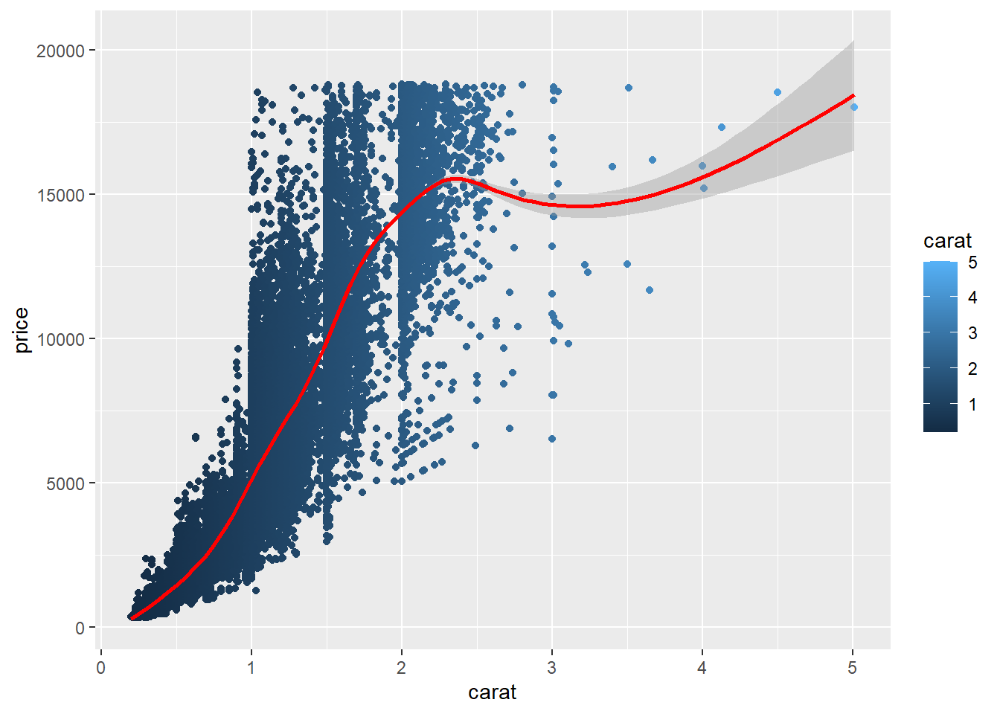


---

### More advanced code: customizing your plots


#### Adding text

Let's remember that we can summarize the counts of a categorical variable by using `geom_bar()`.


``` r
ggplot(diamonds, aes(x=cut, fill=cut)) +
  geom_bar()
```


And that we can also assess for each category of a categorical variable, the proportion of cases that we observe for each one of the categories of a second categorical variable (remember contingency table).


``` r
plot<- ggplot(diamonds, aes(x=cut, fill=color)) +
  geom_bar()
plot
```


**1) Geom_text:**

We want to add text that can help us to obtain more information about the counts.


``` r
## Counts
 plot+
  geom_text(stat="count", 
            aes(label=..count..),
            position = position_stack(vjust = 0.5), ###vjust = center of the box
            size=2.5, color="white")
```


Let's add the percentage of observations instead of the frequency. We need to work with the data. 


*First option*: creating data.frame from a prop.table


``` r
round(prop.table(table(diamonds$cut, diamonds$color),1)*100,2)
```

```
##            
##                 D     E     F     G     H     I     J
##   Fair      10.12 13.91 19.38 19.50 18.82 10.87  7.39
##   Good      13.49 19.02 18.53 17.75 14.31 10.64  6.26
##   Very Good 12.52 19.86 17.91 19.03 15.10  9.97  5.61
##   Premium   11.62 16.95 16.90 21.20 17.11 10.35  5.86
##   Ideal     13.15 18.11 17.75 22.66 14.45  9.71  4.16
```

``` r
diamonds_perc<- data.frame(round(prop.table(table(diamonds$cut, diamonds$color),1)*100,2))
##we could have made it differently, but is the most direct way
head(diamonds_perc) ##Var1 => variable cut, Var 2 => variable color, Freq is actually percentage
```

```
##        Var1 Var2  Freq
## 1      Fair    D 10.12
## 2      Good    D 13.49
## 3 Very Good    D 12.52
## 4   Premium    D 11.62
## 5     Ideal    D 13.15
## 6      Fair    E 13.91
```

``` r
colnames(diamonds_perc)<-c("cut","color","Percentage")


ggplot(diamonds_perc, aes(x=cut, y=Percentage, fill=color)) +
  geom_bar(position="stack",stat="identity") +
  geom_text(aes(x=cut, y=Percentage, label=Percentage), ##paste0(Percentage,"%) if we want the format XX%
            position = position_stack(vjust = 0.5), ###vjust = center of the box
            size=2.5, color="white")
```

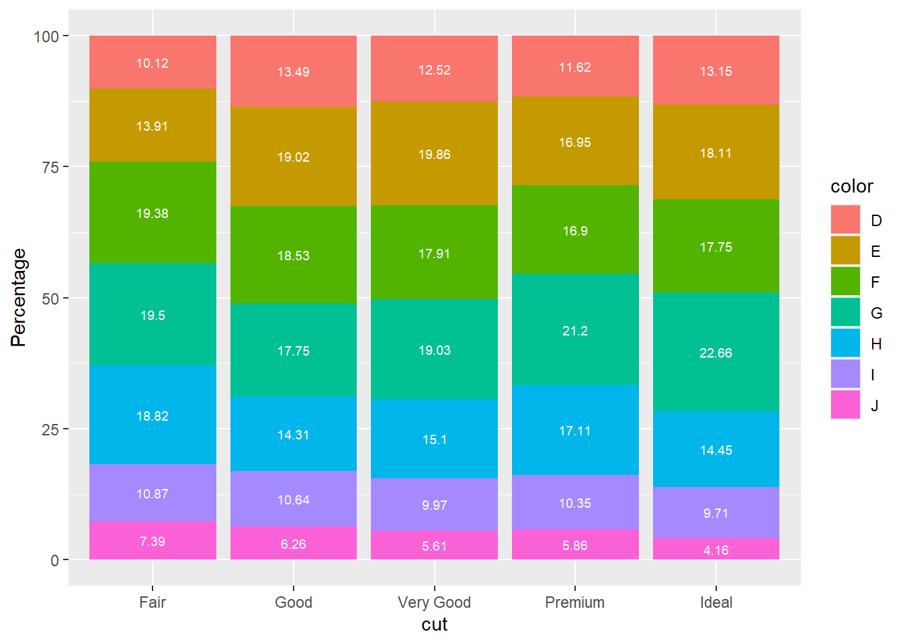

*Second option*: working with pipes


``` r
diamonds_perc2<- diamonds %>%
  group_by(cut, color) %>%
  summarise(
    n=n()) %>%
    mutate(prop=n/sum(n))

diamonds_perc2 %>% group_by(cut) %>% summarise(total = sum(prop))
```

```
## # A tibble: 5 × 2
##   cut       total
##   <ord>     <dbl>
## 1 Fair          1
## 2 Good          1
## 3 Very Good     1
## 4 Premium       1
## 5 Ideal         1
```

``` r
diamonds_perc2 %>%
ggplot(aes(x=cut, y=prop, fill=color)) +
  geom_bar(position="stack",stat="identity") +
  geom_text(aes(x=cut, y=prop, label=prop), 
            position = position_stack(vjust = 0.5), ###vjust = center of the box
            size=2.5, color="white")
```

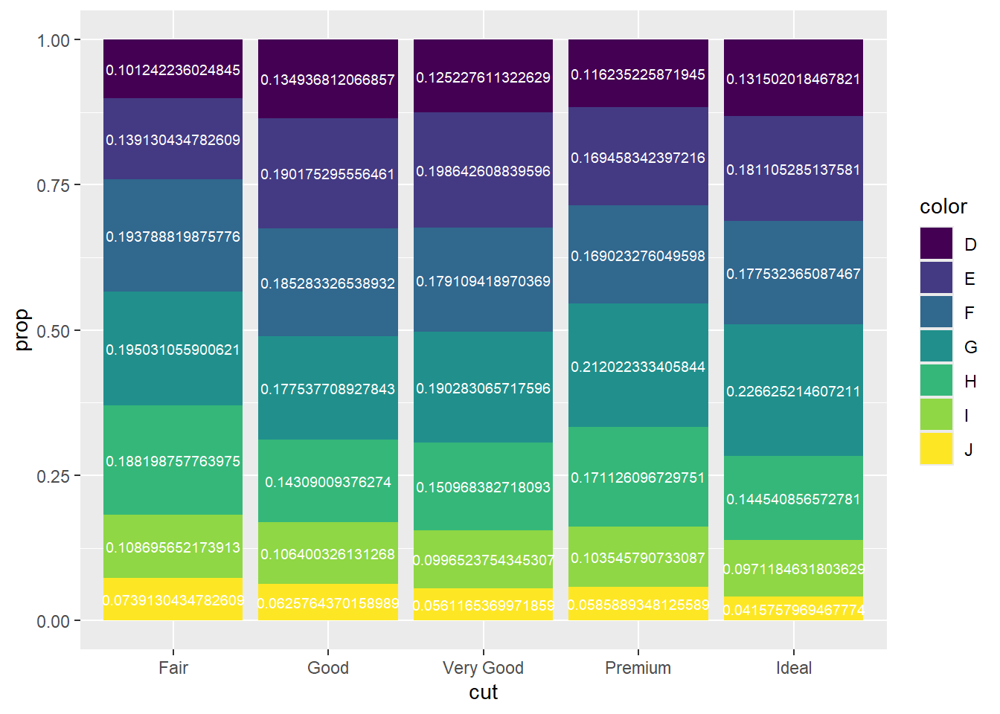


Options to display the text:


``` r
diamonds_perc2 %>%
ggplot(aes(x=cut, y=prop, fill=color)) +
  geom_bar(position="stack",stat="identity") +
  geom_text(aes(x=cut, y=prop, label=paste0(round(prop*100,2),"%")), 
            position = position_stack(vjust = 0.5), ###vjust = center of the box
            size=2.5, color="white") +
    scale_y_continuous(labels = scales::percent_format()) 
```


``` r
##if we want the format XX%
```


---

#### Changing style

* theme_minimal

* theme_light

* theme_classic

* theme_bw: very similar to theme_light


``` r
plot_example<- ggplot(diamonds, aes(x=cut,y=price, fill=cut)) +
 geom_boxplot() + ggtitle("Diamond Price") +  
 ylab("Diamond Price U$") +
 coord_cartesian(ylim=c(0,7500)) +
  theme(legend.position = "none",
        axis.text.x = element_text(angle=90)) ##rotate


p1<- plot_example + theme_minimal()
p2<- plot_example + theme_light()
p3<- plot_example + theme_classic()


ggarrange(ncol=2,nrow=2, p1,p2,p3,plot_example)
```


#### Facet_grid and facet_wrap: stratifying by categories

**1) Facet_wrap**

We will  follow the previous example. Remember that we want to plot the distribution of the variable *price* (y-axis) for each category of the variable *cut*. 

Imagine that for a specific category of the variable *cut*, the distribution of the variable *price* does not show a high variability. The graphic will display all the categories together and for a concrete one, the box won't almost appear.

Let's modify the values of a concrete category just to observe it:


``` r
diamonds3<- diamonds 

diamonds3$price[diamonds$cut=="Ideal"]<- sample(150:1050,nrow(diamonds[diamonds$cut=="Ideal", ]),replace=TRUE)

ggplot(diamonds3, aes(x=cut,y=price, fill=cut)) +
 geom_boxplot() + ggtitle("Diamond Price") +  
 ylab("Diamond Price U$") +
 coord_cartesian(ylim=c(0,7500)) +
  theme(legend.position = "none")
```

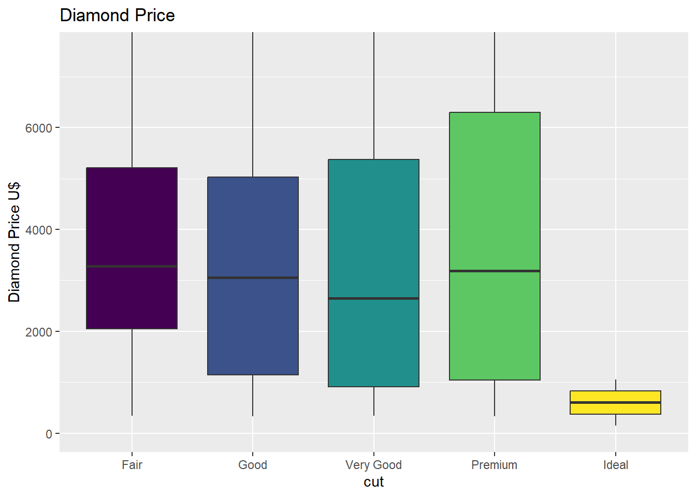

If we want to zoom in each specific category of the variable *cut*:


``` r
ggplot(diamonds3, aes(x=cut,y=price, fill=cut)) +
 geom_boxplot() + ggtitle("Diamond Price") +  
 ylab("Diamond Price U$") +
  theme(legend.position = "none") + 
  facet_wrap(cut~., scales="free")
```

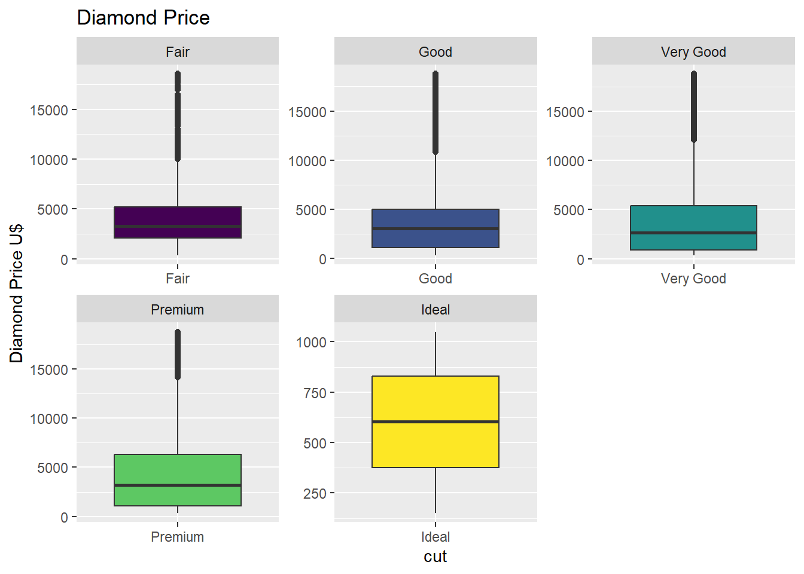


Remember the different styles, we will customize specific aspects:


``` r
ggplot(diamonds3, aes(x=cut,y=price, fill=cut)) +
 geom_boxplot() + ggtitle("Diamond Price") +  
 ylab("Diamond Price U$") +
 coord_cartesian(ylim=c(0,7500)) +
  theme(legend.position = "none") + 
  facet_wrap(cut~., scales="free") + 
  theme_light()  + 
  
  ##let's add more things
  
  theme(strip.text = element_text(face="bold", size=9, colour = "black")) + ## we want the titles of each box in bold
  theme(strip.background = element_rect(fill="lightgray", colour="black",size=1)) ## we want to change the appearance of the box 
```


**2) Facet_grid**


Now, imagine that we are not only interested in the distribution of the variable *price* for each category of *cut* but also we want to display it according to the variable *color*. 
It means that we are interested in the distribution of *price* per each new variable resulting from the intersection *color x cut*. 

We can cross them and visually inspect it by using facet_grid:


``` r
ggplot(diamonds3, aes(x=cut,y=price, fill=cut)) +
 geom_boxplot() + ggtitle("Diamond Price") +  
 ylab("Diamond Price U$") +
 coord_cartesian(ylim=c(0,7500)) +
  theme(legend.position = "none") + 
  facet_grid(color~cut, scales="free") + ##### cut will go to columns, and color to rows
  theme_light()  
```

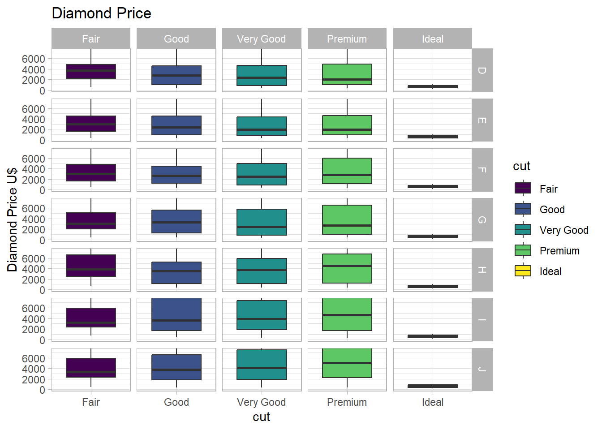


Now we will work with the subset of the observations that show "I1" or "SI2" levels for the variable *clarity*. We want to plot the same graphic that before, but now displaying the distribution per each subgroup *cut x color* stratifying by *clarity*, that will just take two possible values.


``` r
ggplot(diamonds3[diamonds3$clarity=="I1" |diamonds3$clarity=="SI2",  ], aes(x=cut,y=price, fill=clarity)) +
 geom_boxplot() + ggtitle("Diamond Price") +  
 ylab("Diamond Price U$") +
 coord_cartesian(ylim=c(0,7500)) +
  theme(legend.position = "none") + 
  facet_grid(color~cut, scales="free") + 
  theme_light()  
```

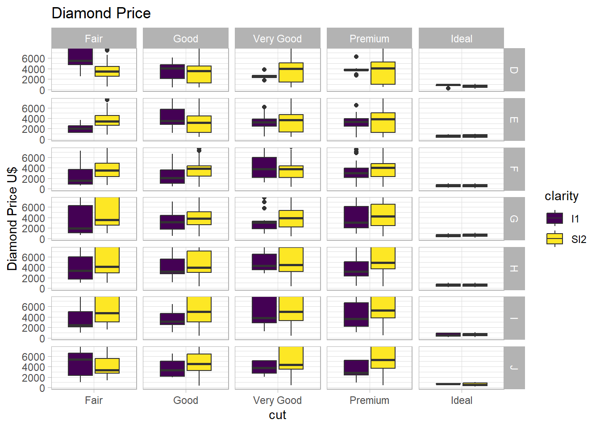

---

### Saving plots

There are two ways in which figures and plots can be output to a file (rather than simply displaying on screen). The first (and easiest) is to export directly from the RStudio 'Plots' panel, by clicking on `Export` when the image is plotted. This will give you the option of `png` or `pdf` and selecting the directory to which you wish to save it to. It will also give you options to modify the size and resolution of the output image.

The second option is to use R functions. This would allow you to run an R script from start to finish and automate the process (not requiring human point-and-click actions to save). In R's terminology, **output is directed to a particular output device and that dictates the output format that will be produced**.  A device must be created or "opened" in order to receive graphical output and, for devices that create a file
on disk, the device must also be closed in order to complete the output.

Let's print our scatterplot to a pdf file format: 

(1) png

- fast option: `ggsave("my_plot.png", plot = my_plot, width = 6, height = 4, dpi = 300)`

- slow, but more customized option: 


``` r
png("myPath/To/The/Directory/NamePlot.png",
      res=600, width=10000, height=4500, pointsize=10,
      type="windows") 

    ##res = rsolution (pixels per inch)
    ##pointsize = size of the text in points (text elements in the plot, font size)
    ##type = device to be used (windows-specific graphics device to create the png file)

  ggplot(diamonds3[diamonds3$clarity=="I1" |diamonds3$clarity=="SI2",  ], aes(x=cut,y=price, fill=clarity)) +
   geom_boxplot() + ggtitle("Diamond Price") +  
  ylab("Diamond Price U$") +
  coord_cartesian(ylim=c(0,7500)) +
  theme(legend.position = "none") + 
  facet_grid(color~cut, scales="free") + 
  theme_light() 

dev.off()
```


(2) pdf: replacing in the previous code the ".png" format by ".pdf". 


## Exercises:  Create new plots for genetic data visualization using the `SNPdataset.txt` dataset. Create a report in .html format and display and describe each one of the plots. 

**1. Analyze the distribution of the variable *GENE_EXPRESSION*.**

a) Create both a histogram and a boxplot to analyze the distribution of the variable GENE_EXPRESSION. Display them together (`hint`: use `ggarrange`).

b) Create a histogram and a boxplot to analyze the distribution of the variable GENE_EXPRESSION for women and men separately. Use a single histogram to compare the distributions between sexes by overlapping both histograms and coloring the distribution for women in green and for men in blue. For the boxplot, also use green for women and blue for men (`hint`: use the argument `scale_fill_manual`).


**2. Analyze the proportion of:**

a) Women and men displaying each genotype related to SNP1. Set the scale as a percentage (100%).

b) Individuals with different genotypes for SNP5, grouped by cases and controls. Set the scale so all proportions sum up to 1.

c) Women and men within cases and controls, filtering for individuals older than 35.


**3. Use facet_wrap to show the frequency of each SNP1 genotype for women and men. Color the bars based on genotype (`hint`: use `geom_bar` to display frequency).**

**4. Use `facet_grid` to show the frequency of each genotype across all SNPs, comparing women and men. Arrange the grid so that SNPs are shown vertically and sex is shown horizontally. Color the bars based on genotype. Note that you’ll need to create a new variable called SNPS that includes all the different SNP categories (e.g., SNP1, SNP2, SNP5) and a new variable called genotype that contains each individual’s genotype for a specific SNP. Use the following code to transform the data:**


``` r
snps_long<- snps %>% pivot_longer(
  cols=2:6,
  names_to="SNP",
  values_to="Genotype"
)
```


You will work with the data.frame *snps_long* to create the plot. 


 

