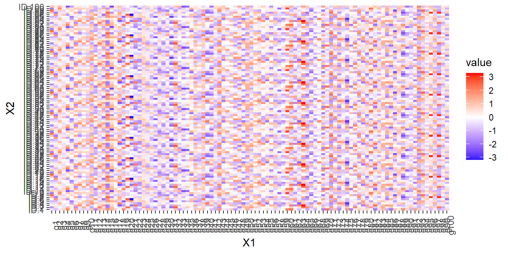
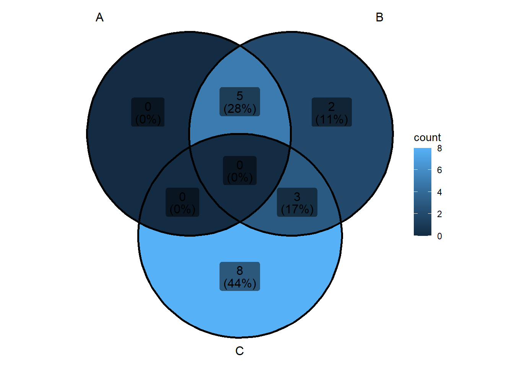
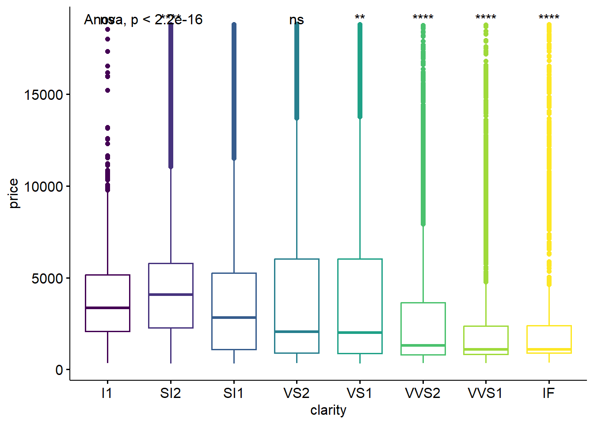

# SECTION 11. Advanced Data Visualization: Extra Part


Beyond `ggplot2`, other related packages in R provide interesting resources to create advanced and informative visualizations. In this report you will find a summary of these additional tools. The content will be divided in two main sections: Useful plots for Omics Data Analysis and Other resources in R.

## Useful plots for Omics Data Analysis

### Heatmap

We can extract only the genes that are identified as significant in a sample of 100 individuals and plot the expression of those genes using a heatmap.

a)  We create the data.


``` r
library(reshape)
dat <- matrix(rnorm(1000), nrow = 100, ncol=100)
rownames(dat)<-paste("g",seq(1,100,1),sep="")
colnames(dat)<-paste("ID",seq(1,100,1),sep=".")

dat.m <- melt(dat) ##melt from reshape2 does the same as pivot_longer of tidyr (from wide to long format)
head(dat.m)
```

```
##   X1   X2       value
## 1 g1 ID.1 -1.68293164
## 2 g2 ID.1 -1.29422533
## 3 g3 ID.1  0.78287312
## 4 g4 ID.1 -0.05637739
## 5 g5 ID.1 -0.17121083
## 6 g6 ID.1 -1.98485362
```

b)  We plot the heatmap:


``` r
ggplot(dat.m) +
 geom_tile(aes(x=X1, y=X2, fill=value)) + 
 scale_fill_gradient2(low="blue", 
                         mid="white", high="red") + 
  theme(axis.text.x = element_text(angle=90))
```



### Venn Diagram


``` r
library(ggVennDiagram)
x <- list(A=letters[1:5],B=letters[1:10],C=letters[8:18])
x
```

```
## $A
## [1] "a" "b" "c" "d" "e"
## 
## $B
##  [1] "a" "b" "c" "d" "e" "f" "g" "h" "i" "j"
## 
## $C
##  [1] "h" "i" "j" "k" "l" "m" "n" "o" "p" "q" "r"
```

``` r
ggVennDiagram(x)
```




``` r
library(UpSetR)
x <- list(A=letters[1:5],B=letters[1:10],C=letters[8:18])
x
```

```
## $A
## [1] "a" "b" "c" "d" "e"
## 
## $B
##  [1] "a" "b" "c" "d" "e" "f" "g" "h" "i" "j"
## 
## $C
##  [1] "h" "i" "j" "k" "l" "m" "n" "o" "p" "q" "r"
```

``` r
upset(fromList(x), order.by = "freq") 
```


#### Additional genome graphics

-   [ggbio](https://bioconductor.org/packages/release/bioc/html/ggbio.html)

-   [Gviz](http://www.bioconductor.org/packages/devel/bioc/html/Gviz.html)

-   [RCircos](http://cran.us.r-project.org/web/packages/RCircos/index.html)

-   [Genome Graphs](http://bioconductor.org/packages/release/bioc/html/GenomeGraphs.html)

-   [genoPlotR](http://genoplotr.r-forge.r-project.org/)

## Other resources in R


### Advanced visualizations with ggpubr

`ggpubr`is an extension of `ggplot2`designed to simplify the process of creating publication-ready plots. While `ggplot2` is highly flexible and powerful, it requires a bit of coding expertise to get polished, customized plots. `ggpubr` builds on ggplot2's capabilities by providing functions that make it easier to create well-formatted statistical graphics with less effort. 

#### Boxplot

If we want to do multiple pairwise test against a reference group to compare the mean value of this group of reference with the rest of groups.


``` r
ggboxplot(diamonds, x = "clarity", y = "price",
    color = "clarity")+ theme(legend.position = "none") +
stat_compare_means(method = "anova", label.y = max(diamonds$price)+10)+ # Add global p-value
stat_compare_means(aes(label = after_stat(p.signif)),
                  method = "t.test", ref.group = "SI1")
```



All pairwise comparisons. We will reduce the number of comparisons to 3, by grouping different categories of the variable clarity in a new variable called 'clarity_grouped'.


``` r
diamonds<- diamonds %>% mutate(clarity_grouped=ifelse(clarity=="SI2"| clarity=="SI1" , "S_class",
                                               ifelse(clarity=="I1"|clarity=="IF","F_class","V_class")))
stat.test<- diamonds %>%
    wilcox_test(price ~ clarity_grouped) %>%
    adjust_pvalue(method = "fdr") %>% ##FDR
    add_significance("p.adj") %>%
    add_xy_position(x = "clarity_grouped", dodge = 0.8)
stat.test$p.adj<- round(stat.test$p.adj,8)

ggboxplot(diamonds, x = "clarity_grouped", y = "price",
    color = "clarity_grouped")+ 
   theme_classic() + 
    theme(strip.text.y = element_text(angle = 0,face="bold"),
          strip.text.x = element_text(face="bold"), legend.position = "none")+
    stat_pvalue_manual(stat.test,  size = 3, label ="{p.adj}{p.adj.signif}", tip.length = 0.02, step.increase = 0.05)
```


### Dynamic plots with gganimate

Sharing dynamic plots can be interesting to display the evolution of our variable of interest over time. You can check more information about [gganimate](https://gganimate.com/articles/gganimate.html).


``` r
library(gganimate)


ggplot(data = diamonds,
       mapping = aes(x = reorder(cut, price,FUN = mean),y = price)) +
  geom_boxplot(alpha=0.3, outlier.colour = "blue") +
  geom_point(stat= "summary", fun=mean, shape=16, size=1.5, color="red") + 
  labs(x="Weight diamond (cut)", y="Price diamond") +
  theme (plot.title = element_text(size=10,vjust=2,hjust=0.5,face="bold")) + 
  theme(axis.title.x = element_text(size=9)) +
  theme(axis.title.y = element_text(size=9)) +
  theme(axis.text.x = element_text(angle = 60, hjust = 1, size=9)) +
  transition_states(
    clarity, ####  This is the variable based on which the transition between states will occur
    transition_length = 1, ##It represents the number of animation frames over which the transition should occur. 
    state_length = 1 ## this parameter sets the number of frames each state should last before transitioning to the next state
  ) +
  enter_fade() + 
  exit_shrink() +
  ease_aes('sine-in-out') + labs(title = "Clarity: {closest_state}")
```

```
## NULL
```

When creating reports you can not only share dynamic graphics but also interactive ones, which means that you allow the user to display the plots based on their preferences (filtering by specific variables, subsetting the data, and others). Check the [crosstalk](https://rstudio.github.io/crosstalk/using.html) package and see the different options you have.


### Interactive interfaces for creating plots


#### Esquisse

This package is a 'shiny' gadget that allows to create ggplot2 figures interactively. You can visit the main page for further details in the following [link](https://cran.r-project.org/web/packages/esquisse/vignettes/get-started.html)

We only need to run the command lin `esquisser()` in a new R chunk.


#### Ggplotgui

`Ggplotgui` refers to a specific GUI (Graphical User Interface) for creating ggplot2-based visualizations.

-   I is a graphical user interface (GUI) tool designed to facilitate the creation of ggplot2-based visualizations in R.

-   It provides an interactive and user-friendly environment for users who might be less familiar with coding but want to leverage the powerful ggplot2 package for data visualization.

Let's check it:

1- install the package: `install.packages::ggplotgui`

2- run the following code in a chunk: `ggplotgui::ggplot_shiny()`

